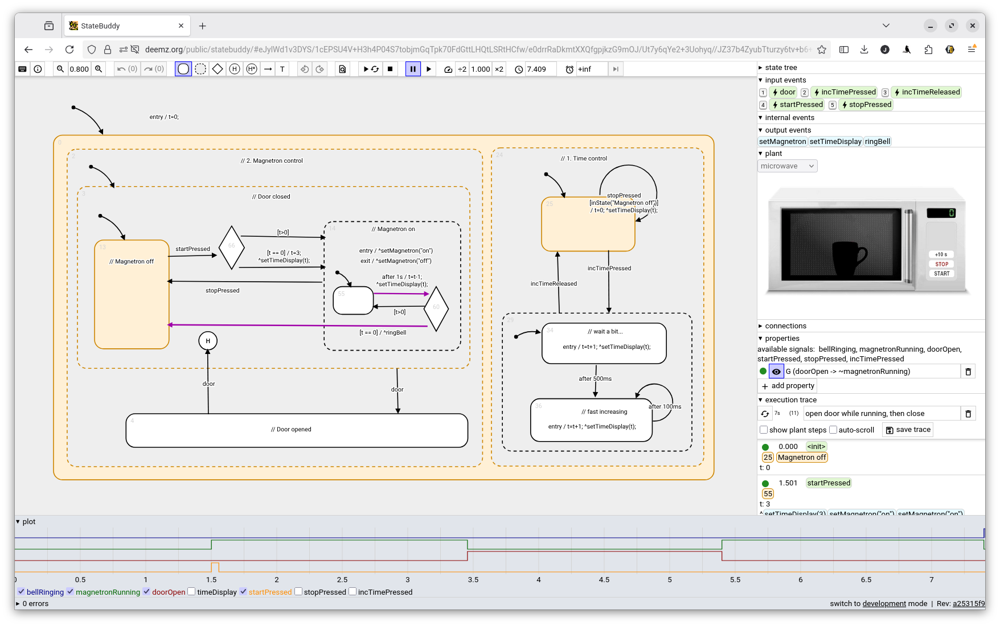

Statechart design, simulation and testing tool, developed with the goal of teaching Statecharts, but probably useful in its own right.

Live version available here:
[https://deemz.org/public/statebuddy](https://deemz.org/public/statebuddy)

