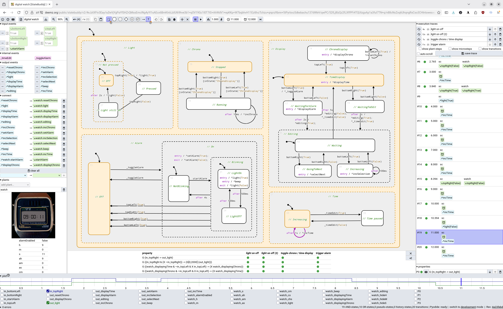
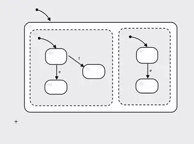
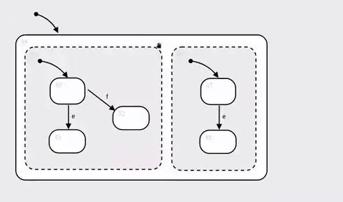

Statechart design, simulation and testing tool, developed with the goal of teaching Statecharts to university students, but probably useful in its own right.

## Features

  - Intuitive editor (inspired by [CouchEdit](https://dl.acm.org/doi/10.1145/3417990.3421401), which was in turn inspired by [StateMate](https://ieeexplore.ieee.org/document/54292))
      - Low cognitive load: concrete syntax is just a bunch of flat shapes, that you can *freely* manipulate.
          -  
      - No hidden information: the parser sees exactly what you see, nothing more, nothing less.
      - Visual feedback from parser during editing.
          - 
          - Syntax highlighting
  - Builtin action language
      - Variables, simple arithmetic, arrays and dictionaries
      - Pattern matching on event parameters
  - Simulation
      - Time simulation
          - step-by-step
          - (scaled) real-time
      - Coupled execution: controller <-> plant(s) (currently 3 hardcoded plant types: digital watch, traffic light, microwave oven)
          - follows Coupled DEVS
  - Omniscient debugging (= ability to undo execution steps)
      - logging of microsteps
  - Live modeling (= ability to edit model at runtime -- use at your own risk :)
  - Ability to save / restore execution traces
  - Metric Temporal Logic (MTL) property checking on saved traces
  - Visual plot of event parameters and plant state over time
  - MQTT (over websocket) client
       - define mapping: Statechart in/out events <-> MQTT subscriptions/publications
  - No need to install anything, everything runs locally in browser

See also the [comparison with Itemis CREATE](./docs/comparison_itemis.md), the tool it meant to replace (for teaching Statecharts).

## Try it now!

Live version available here:
[https://deemz.org/public/statebuddy/v2/](https://deemz.org/public/statebuddy/v2)

Or just play with one of the **example models**:

  - [Digital watch](https://deemz.org/public/statebuddy/v2/#eJztXFtv3MYV/iuLfShsQK05M+RcVKBALk4QNE7SWEUCOI5B7VISkRW55VKJHcP97Z3LGe6cmeFq14r6lJfAS/KcOZfvXEnl/bJZt2M/vBzrsVmev18O/V031t31ptktz1+9X9616+X5kizPlmO//bq5Gs1Db5fnVXm2fLc8l/TD2XLX/t7AZSJpZW8QopS+9UvbGfpa//fDmefGEm5CWSJeFhG7gsIdUu259UPAjCbMCGHSyVBUmJ0gzEnN2Ay3MlWUcSeBjGSrmNO0KukMs2pOT1LIiBdxN8rQaIgXT3hxb+lCYWalpPcwExmblY5IcR7bjNgbVM3ZTGa4qRLcVmJunBXATc5wUwk3CRIIEXmAMnejJGKGGSlS2UrhJKAROAh3PmDlnKIkDQNCHNSEipxAKDiBFHNhQDLQpZSDfUSEEM4AhrPs0rAiVDrxOI+ULSuwKZtll4YCYRUEFoukY6WEwJpllwYDF06l0kZjyI0DeqpZbplwkIBTymNuzhPVbD4imXigFLBVRo6l1CFYzvs1DYhKOG5SxPmSODSScl66NCJIJQBdJc9LJ2alo5mQqAB1soj8Sgt3juCz7NKYkMJn2SjLkbII0l+eXS4mpEt0ktBYOnmfsrmYoD4J8zhmfQ6cFy8NCq+tLjaRL3wZkrOupWlQEM49P0HilAI1V8zyS8OCqQKyWlxaQbr5DEAzYSEcXMsqNl1xXwKgmTIhQbYikg2uJ/H/+my5buvbvlub5kT/uml3unl5537Uw9D/FnYt1ETObqyHve8dzm3Fbgxf8LtDhKg+BE1KERNL5xhqU/CemkJTYQpkQE4icgaVglq37slLqG6M0ZCcRuQUuo2yqvDp1HmE6XwUkLNYeAWZW9K88ESF5GVEXgL0SlvPA3LlyKsC6V5F5LIo4XSFyCWF0ynSncfkUJl1NcPkHNBIRUguInIBAV+yApH761TxkFzGpisY0NtQ2dOryitfhvQp6CDt6QqFYUehUeNar6AFTYDHKqdnRQVmwCroTYvQe2UMPcLhOd1mYgY8zyAGH+EAE12ZIwYEYMkQgwR+wrdqJXbhdIPpsAgYxAAkFDKPruaREX1KKkMMlTEEdbrzz7HIiBL6PoEYxCCcam6MQuKLO6XIjTEMSQltjUE7Tj/cZxAkQQJEAc2zjICsb0Bl4IhBgsQKVBVlFamgoM6rUIUqQaKAfsA1CqEEBfQdZRiKVYJEVqjpOewFApxJmMeqBIll5duvyAvllMRDIFUJEnWqgpY4wkEFSYqJMB1UKRJLP10yFUOR+s4iTIdVikU/oBIRoxlQqu8gFjEauXcExZ708Sh5WMuqGIsSoBj7UQJADMIC8hiJHB5TBQaiLCq4jnwQ41BBfVcVJlfTeFyGMOQxDJVvmosqyshQY1UVas9jFEpoVpTE5BymViXDMOKZbAgYjiAIE4hQYT3gMQJpCbaP4FPBPC/L0Hg8xl/FwPMqakNKIEfVjCelGNoNbWMR0XN/AxkvKcbFtMNQEQMfFzLMATzBHkQ6ITSWwGOfIgli9OkUAc/xImsCeyNgkORBJqbVSRUXRN99IyeKJBPySnlhVVxPoNnROS1kkeRCAbMaLaJMJAhwQGqIBIcFJIEyFqGAbExRYyGSXKi1cCkv7gv8GMmIdqVurcfm7Rh21sLOQfqi/vezZ4uv2+ubMR09IFWb2TaQokKkn7e77aZ+l1shAUxQLAuBqD+7Gfqun+VRgRq6RIc8eIZHuqqDTBrRyj3tZT+O/a0heXIx3DVPF89+6n4eml0zzrAkAtotnSlCnmrPs+nG4d3i2eLntdNpjlMFbT9BHpbFnhMQONEyWzCIVp2NAgakIMg23/TjYqtV2jXrhIXfvlGULyRm8FLTbDPEEuKMViE2JD1a/krB6ajlkQwx+N7g0jtn8fNm/zMFK0QtK5A2GOcX7W0zDzbfIxPEoYoBEwj1U/eq7ezq/clPS4Tln5ZPX2dWDRCVaN6ROCS+vbpKXQV1UfcdISGfx53RNKci5AsEGimRAN/N4KWEsskQ+KWaD6gTzTOlPe3L4ARVHDpBq/xm7K+vN80nm3q4zayLoFYwGdZVRQ+4NbPUgW0iU6Huivxx2PAjQHRCEA/11dgMC7rbR8IX9WaXkVbPMTDsh7GpyrywM0ymYaWkyG5JOFhnzDEpC1jYsLAbVjwT5TMs/HqlrBAmcMx8f9d1bXedyVJ+8g+TjMJ4/6FuR038RT/MIIiBa0q0olEqx+Wif75u01JK/Ha7lBVK18V8CM9JAzWxRH2i5NgitqIvdmO72Sz6LpP7aWbvQwoaw63a2RAzLxm1duCkv+s6+WbUGcboOuv7Ctq8Ci2H9NQVn0GKWwvqtlvNlEsFq7sKYVF3urno0MJ5cW0gYmnnAhxWVFWJT6iOOiHjJeiFK4754dblueOSSVrwzoMzgcixk/MI8fsQrgpEm0X9vNtEBA0M929TTPmpTKANACE5iOseywo/Zz8xvbdA2CFJwj3cYoAm2AfktNTPCudJ8/Yy5BLAuHnbjkgrCJOMWiARzgIkSc0Hk6rwOxg04hDC83rN5mb4BEAobB7c33+6abtfckBRfl+jEERJANGDhZlJvwHB9BimX/Y2qX5jLqSukX4SxywwVL/qVkNT77Jg9+/gJWqsCC3isNeZ+naXcQXEqURrM0JxE22TcSZilN8koDmRUJqJGJ0cXzabZjW2mXSu9RDACUGCsmzsGTZzFoVXfxzbQx7tVHhPipotQsuMHIe6eQVv8mI+ATbtIJyXQgA0JeqlCM31y5dNs02Phw5KFdgMIo35g52YV0Mx7GAMUD2kzUaZ/95CMeRYlgC0ygLUb+SUQIowjM+ZYQFysEJbbcIoos2NK/69oMIJiiWVv0wlFvCJglIK0Salfkbhwm/BCIpIFiDn8GTKpN8tMSyBQBwO1QwfRbrmIgAyHobRPR2Jn9U0ExQDDIPH5ZaME5R/WU/QRKwi8BnfL7b1XW7iI2L6GIwg/JTJSHbYHNxzwRbFqf5QnmYF8ds61JWUSS0/6Fm/2EOzBClJzi3zba3Ic0n7Wt/V5uOLeQfTorBLuk4Tf/W5iXUdeLsp2Z+/em3ert/0v3236TX1lRHMvG5fN9/VXbP5oV2PN2anr0F31Xbr7xs9Pazsq3jz88KJpM8f3A1/4YOVyLIwz972GgMv6q3590aL+cL+7teNybVWGM3itl2vN014q+vHG+eywUAgvGWNoU/5ve9vl+fF35TT4p/Nu91eC33hi1BouH6rWWy+qW8Nn3V73Y71ZvFbPa5ulo7m8+by7hqe/uCM8Wk9GNnNXTt2XwxNg875qtvejc9/1alfnz9qiPjL2lldvUnvfHs3Zim+29TdGF74rO865y383NBvm2FsG3T1+dtmdWeevRisxvs7L/51cTFJvDWH7KbvOt1Pu8K1eENGMXmlc8byRhrfbVPbeZRZBQzUNJRXWnbHt7fqvggsv1tpTv3eCvoS3o+2XUSRiNV2M8QmdI46cQPL6RPPcmRHn4L3ZieeFRKfeqJvYT7uSEd99JnNNHCeeJwnPPqkcJg/8aw96dGn+cnr9MMmylM0Czvx05XbU5+gX9Czn6zhRHv0edAVn3iSpTrFjh8XbZ4wf1JCG1kyHBuSg62Y2Hr750+N7I/FPyb/YKr/1lWSd8/tx/62HgS15dXyy8WTtnvj29LFX/+x0BK9sSnQtDD6Nrr/l8WTHxf/Da48fWponnz5qjjT3UjxevFkT//Uc7DSvgHpzFhuWse/eD6mtdG/flzsfzqmPy5iQqfZLF93+6M4G5E0X/MxoY6wXxuowLrLKlyJvagvN82+bxhNCd4Ze9Z3Y/9yNfSbDeoZXrT62sux2eKWRZfubtdCwQ+u28IKdd1frn9t1hdwzqtXri4t+m7Rm6b9vRPB1t9de2u6T/tBkW53L+vrb69sz+LKMxR47zJtvG091LeugTAoQRzMh+NHc3DmeG3ag029G1+2tzbAziUtub6IhV48oU/nBLerqYcIToV5pX2y4CEL3eYXDxNCMvMhyYOtp+d8PUIa87mVyWLlgP1sYY5ZrP2LyKwpqV3jzstgJ4mDlqzoQQhgBjlDlkV50Az3ilDaD3NPFSE2oyiZcFbUE8a1nqtql72zZuPmE66ZE/cD4kGpBeEnsZh1P5Fcu9985dxYwMB30rf/Ge0MaEY7yBGXQ/9LM/x72JgGfnf+7NmmX9Wbm343mk+0zHiq09ONrg7tqnYzIRDqYWtww9223u1+64e1+7Vr9GzoL8CzTWdy32efTBdWtXv4st41F/22Xbmfo/knfJ89wmVFpGKF5KK8vLqSrLhSRFWXotSz62Vd2NWBK3L1dmvaRMsIauX+0oc0B5/9WchOLGTmg8OtXQS8X/7a7lptS7MXsEVs0tVPlYFlAOua2oF4GvybYeiH3fO327pbN+t9bVy7EdtN1J9+2r9Fle7LoV2jC581m81uT21WCNMR7djcujiCsdSCZdG4yVpDczrcyngWPOdm8yMedWg74sGVG9bTR0yjZZcY83I3fnZfQOdw4ByY2LPHTNaB5Q0zBX9/tr9qSsB9mxC0TvGrFjm/WYm3J2ePsPnZ7pq7de/j/UHbmIDi49YxYXd24j4mSlQnLGTsO8ZjNzKPuIGxcjx8BXPaQJMeGk00j7GTmT30EZcys2c+0lYmPe8R1zLpYY+5l0lPe+TFTFa9x93M5HR8pNVMetTj7GayVjx2OWOJ///bmeP2yalmsFCOV+j2L+r+bGJP38agvcj7ZaFNzPRkvPrF9EzElFg/38WTlZ6j3Pv0ws6RwWwdU6J5mD1smqW8OLiVOWKgJof3OvcP1PZD4IcO1IRS+Bsra7+7oXMjtdnv6EZ1sWnGRTsuBleS5uxJhDxtTs7ow+iBfdFps7b/VGNSaVpZGZUsMo1S173bu83DhPNTdj85pU7b3uWAwiV94AJQKHXKJi4nhCzNN/4PEUIp/jFCJM4tudo7d7jrINjPFmYnsrAd7SGgKnJwH3gvSok6ZRWXMyVV1XzcBh9QHMZVQeaRmWWSE6Uq7g25+0WpCjGPz6NF4bw4CLB7HcPt/2vhIY6RjDwsI0smHogNUtADWhyZSEnBDuxqD2VSxIU81Byagzoh2GYjnpu/tTeXw9cywYcSH/9WxjG5d3G2dr3M4WXa9Nj+OLhQ76/kmqLppjk3nFPD676TxoxixkjCmcPrm+jC/nesEGIXdNf++XB9MOmMpvvoKlIBjcfTXhpmWP97P2YGV/aT2eTY/ew0rdHNjBMQobODIAitPI2ZkcnMted2Y76ObsWPolMDh2K25kasKXg50fZNRtYYRjmh46Y9uh0f766upjg8y6+Czz5iAXz2By0S97fabqdHh+Ry8IWbUe/zvjNDa/yl2/8AzZjhQA==)
      - Note: this is the solution to the [Modeling of Software-Intensive Systems 2025-2026 statecharts assignment](http://msdl.uantwerpen.be/people/hv/teaching/MoSIS/assignments/Statecharts).
  - [Microwave oven](https://deemz.org/public/statebuddy/v2/#eJztWF1v3DYW/SuCnhysa4siKUouUqBO0qLYdZs2U/TBdgN5xPEI1UhTiRPbCdzfXn5cSSQleZ3FFsUC+2J4KN7D+3HuuZQ+hbwoRdO+E7ng4dmnsG0Otcjr24p34dnlp/BQFuFZGKPwOBTN/l98I9Su+/AsyY7Dh/AMoeTxOOzKjxzWEUVYP2GUySe/lbUCyOXfx+MBLp7AZQBHmAuXMaofJJmF1rQ2GJ6AoTjWRnGceWgx0Q9wli2hkSlalOF550iSgHOLcHQKhxDTVhRFHhwycDjCS3DJBI7FvZEXK44ik4R0EY1N0OI4NcWLUxct7atKFouaTkOlpqqY+CRJDFqMs0W4bCZzLIN8e97FiUlptugdjmZYEoEXlHpwEQVyL7qHpx0h8Qy7KI49PGYOSpfhph3BiCksoR5aakqUIA/s+jgsynzX1IXdunjaHhmh88jU+C+za3k2bQiSGXuMPMpR43FGH5Uz27KTyvJg+ZKqKMHlbptXVXM3BafIJJEijZK3bXPnBKRaqhN5O9ICg4X0hitws8z6IkZ2OIlvDeeh1DWP+/aJmW3OPPM0BQnAyDFP076RqG2eeuaEGaVimjKjOWHmdCoZbZlnnjmOzTaceubgFZa9P5qTyDNnoJOEuOYYZJJgO3aC/NSB83GG3dTFGNo+ts1j3zyGwsl2cysXUwCmDgD2ATCF8Jnrv3wAJIrs9BEy8QCnIMXI8wAe4NQmD5lQD0OoSUw8D2LjQSJ73gKYsI8QBrrKXACCYtA6Jwc+/xACAJp4OUBZAm3hAPgMRBgjSHbkewDDMkpsAJ+DjIKaxG4OWYqBXHYGqM/BFIN54iYggxKSxFYj6nMwg/ClJrn9BwUkme089TmYUdAOPYimHUCx3UDUZyAlPdO92Pt7BrH5R33+yVONkyiaNSdypisNFPxe2BLI9LSQi/J/Xov2ITgNxMvoy4mYYiCRw2JGR+vT0wCdBKtyx4N1I5GaamasAZEQs4NJkYMSnwQX+W3NJUS9CJWgXmsdf8iIJCfG/vwgRFMfrdoDf3FVX5a1vpweXYXjAc1mcxW+uL6qTdzBrx0XKojXZbev8ocj8WKaC4RBkmPiUII5cbxumjZYV03Hixn3YSRQh5KZA2A5WU8QUgayEts9wSyES/FVdD09GYOeO4KcIDtxklZ25qaDNTJcwE5DJXhKJZXNIYwFtDQFhjPbozSyIwlevgyia81N/OVV/ZwiJYPu2n2XREsp3mymV1gCQyFzcmWRjN+XYhLmN3nVPREniWzKJlYLlfVaRfVk7uVAgkmLbO6xZITJN4K3Aep0usQXaDZhU/cykD9sXzOSZMm9hSjlvIvgSuiEGS935gSDAkdJ4jQ3+3fcTrMYZrBTcrct73JZsjy4KcXJyclMekl/BbTTwNJZNv7alvXtOa+m+pTCKKNOgzM0bRFZon+g5+oOEJKmdu2TzK89jaJdN2Pe3yRc1bFKXEjN+mHPF6tL4PUjSZxJTGcQlpqdwWXGvkqwaMLe+QgII3AXdsiVOhXe5J0IJFlbnneyPjN5gOsIkzdty4kZ/fqs4sBIYg5rqeubHgqNzM/cUICXJpaYWV1Lq+9eqwuInPW84mtRykFwdnmtXpW2zd3bqpGmQuZZvToV/G1e8+qXshBbiaUkeiPfj37i0uO1fq1SP1djlY7uVXla83zlVU8+e9T+aVBlvWsOHb/I9+r/Sjp9oX83BVcdrb2TaLuyKCpuP6obsTVFaMvbrWNl3lvDj02zk+kzMf2TP8jryUaxzyx8Y8cA6ztpX32f7xTIrlzLt7r8Aw/N/tf85nALOx9NXs7zVjmtnur5v2o5d874rt4fxJsPsujdkE+9LJlY59X0yQ8HMWvxtsprYS+8aura1M3d10oKtKLkbqxv7vn6oDavWh3uaHDx42o1bN2rU7rhO5v5qe90mnFDRlRT1dMsiYe9u9RzTXuvCCdrIe9dtcFsdKwXVsq7tURpxhRoAtj9IR+XtWfkeFXWy7aqdZ575jBzP/vE0fLZ51la/xlnDVbz5ziG7nl9L86dp91zzhl2Pyp52BuCPbzRn2Q1SyzKXYbfBkfDye970+CLr4I/xuVdn6KfDnUto3gRqm8okswfOPBXalVk+LnKbyo+dp1Q/O3UsflBNO8kokyATWd1yDvB9y7/Je3rroRusdY1Md2ekA4WKzjlUn0h4kpd9KdKef7ud6FFVckl4Ny0zW+8/bmVfoR33dnpadWs82rbdOIsiyI1l6WrW5nLcp0bnQVDqVcygaHcsM+77q5pC/Or41Jw+wXYy2uVh1dfDwvr3Gy+yTu+avbl2vwU6l/wXMAyXVM5VTOCSRHjhKw36TqLM1xkCb1JOc0HGuT7vRJUDQSEGpceVfH1XPgUfii7UrqjxoSqhXp008hr127QdN62Tdu9ud9LKebFWL/CiKjRzPPz5t4px7dtWTgLryS/u9FaTYfhiFLwnRES0B0dRMCNdsqUDYeryqomGfYZ9X3GVpOFZ2xcGzmeblE9o+fTst9WAz1xAu8lPIAeeGIvCPesM0MOYZ6TOLM97Fej5Olp6IxTM2ijE/XNdWm0+iP0+C+Y+/o2BHeYv3Ug2xJjyeO4e3kg24L310zk/0/g/90J7N2n8DiRx/nrTt3nzlp/7v3X5ysse7MjLO5ysd6+3w4byvq9/lD0tuVdx4vJunnB7zVvftIc/yfz5U/tLosJ)
  - [Traffic light](https://deemz.org/public/statebuddy/v2/#eJydWNtu3DYQ/RVVD0UCuLEoXiRt0YcmTYOgdZMm2xaFkxryimsL1YpbiRvbDdxvLy+jFUlpHdsvhkVyzlw4c2a4n2Ne1VJ072Upebz4HHdi18qyvWh4Hy9OP8e7uooXMYqPYim2P/O11Ieu4wXOjuKbeIGS5PYo7ut/OawjRpDZyXKmdv6uWy1fqr+3RwNaOkGjxKKlqY9WFNSCETqCic7BwhMslGQU0KiPRnMCaMkBNDpBAxGUBZaRLDEbLGMHsMjUMpQwI5SyPLAstWjUqJlDYxO0jKQWjARuprSwYAfdzGZMS+21MVQEjhbWtDQ55Gg+RUtt1FJKAtMwXA1Bh5IDTXMthVjTZOIpdrJwFq6YcZXa3M2S0LqigPw4aFwy46u9hizNgkrIGBh3GG5aCVlujWNkUlg2CEV2EG2mFhC114oZDeHsRnEwcmiawFlhfcUYB2igJg9d/XgUV3W5EW3l0cm0zhCBdMaGN9za2F+KRruse0VXNw4Y1fkHOvvLsmnE1QSdIKhWWhiUsuvElWeRrq9elt1oj709puPDNThcqrWmQLdOpLJAOM2tOpKknjQGUKIu0RHPA3E85ECSeeIpiGepp70ItSfAwCnxbS/Q3iqHjJPQcwYkZarN0Z4MfENccRSKQyqoCw2025gg5mlPA/Eisb4TlHviBVAnw9QVx4F4DszDDMGM4jlUKUmZK05CcQzElWNfnEFy+uI0EKfALDjImgxgMcOueJhzqi9BT/EjT6A9sjxxxcOsQ4QO3ZL5oScp1FDuBS/MO4RyG2SMgrtLEThGPf/DzFNcWEAXwQEAbBDmpi6e5B6iQ/KFFkBSp7qCR4BJ9qGhL4eFO6RvlngWhPmHSAZpzoogiNlAUG4QcZiB6hYggykKAMAChtwCwmEOIpIPAIELlAAvoMSwmOTX0iUxbGhVLar/eSu7m+g4Wul5jnfRd9E3M0McBqbwPGIjyvFxhJ5FUpFu1PGLWrTRheB9tK67Xk7QGB4q34PLPLj0WaQag4LkrcUVLZ82AzyMcMS77dyD6ng1HRUSmFYyl2VIMgqedbzncllveDfThFgBde4mCUGj+FY09Yq/1jHtdlsZHX9o/zqr6r48b/g8KCMUMHPXl2JyVwpJAW2b8uYdr77VuKOp6nO8ybkpBLgde/RI0juU/MlnW2U+hCDzQoDnkAbrfi+bHX/yDXo6Mx3hoRW6SU/ICFeutVco6afpCV1bV5Ij62T56Vd1a54uTz7EKh0+xE8/eoa96jhvp0ZRIFpSuOlFWGgUTZLN1KwCwXyderF2kvPuhFAxsSRHsesXTUL16VQ3ggcR9QqDOMl0endE3s0UjZrGLTNR6lYNRfeLR56CTV5zINkduWfu5YEpjmlu1XgthKYHa3NaidAfGXUrkeJ75eLQ2Zg7ulFyh5O/zFFbzoDDc/cC6ZS5J+UFwZmrsQzetdi9AJpN/Oq9hgD/zfQF1etgYMjcgYWyL9LJt1+kwzTJAdoO9K3Ce/2DHfN73vCVVG1GNbWP+hVwKa7eNkKJym7H9aug4m/Lljd/1JW81KSi6nitRv93XJmwMi8G/bm0Nirdnd0YFm6NNQZCn92IXc9Pyq3+v1EmnphvUXH9lDC2KIhNXVUNd7daoTpXe6Hh64tLT8o+oeJ/hdjEi+RZYX34id+oPr0um57bhR9dm2F9oxCaX8qNhpFduV7Xq6jR+LGV+YGf7y7g9K2NxfOy06brXVPzS1VWnp7X7XYnX35Sl9XvY2iW1b23ZTPdebOTsxJvm7KV7sIL0bb2rvxzndjyTtbcW315zVc7fXbZGY/HnZNfl8vhe6t19PtfouynGW9M9nkx0fTQerEaQiVvttMIDolm3NDZprrlSnlg4YVx+sSJf79SSGKMhVoaW7PaqttAYGJc3c7L6mp6iL59l36cShC/t1aPch6u1Rd/sNahXT9SqxV/aIQfqdSTfrCnj0ojV/ihXkIzepyTRvhWM/LW1vfNS/OrsSlTp+JP41fRf0/U2PGmjb6OLnRo3rRPY/2Di6KKTxzYQbF/Yst/qfvEyGlS00OvUcudFO9XnWgaj89OarX2XvKtT6eKVtq+BjJy1k25A+cMy+UnXi1Bz6n+QYkbhlikhX40b/6RplHpFgQS5534m3e/dcqS+KpfHB83YlU2l6KXiyJJdPNUxqrnjKxXpe1dIKi6Qme70Lbs+yvRVfar56qJDQtwlrc6Ei++3y+sSnv4vOz5Umzrlf2U+l+wXMJysS7yHONCdcPVecVTNd6sKaH0nBXpukD7S1WNbqvblgGC3HGX3EOgwjtl1m51EpiW/Dn+VPe1slp3aHNpdXsWjmCDOwrozE0md91N65nztsLmBPwdtw+cXdgt21i8HfkFyRvLmHOi+sE59KpkXlqO7AdZreJ1LqQUm/3UoUIjuv7l9VYNC3uX1bHKNnjbz58/F9deLr/q6spbeKEM7UdpPb/sVdSSb2xvg3Zo7jbitq+rdNsr1+5oLtmfs5PBPY7a3LjHwZUdFaZHNKGYCeqw3XyYHCLghjv0wMAwq2YfHZgcsf5FbtQ9rCbJ7f+PgHSW)

## Building

1. install [bun](https://bun.com)
2. run `bun build`
3. build artifacts can be found in `dist/` (`index.html` and a bunch of supporting files). Any static file server can host these files.

## User documentation

See the [manual](./docs/readme.md).

## Development

StateBuddy was written in TypeScript, using React as the frontend framework.

Most of the application state sits at the top of the component hierarchy (`AppState`). It is an object that is JSON (de-)serializable and therefore easily persisted in between page reloads. I tried to divide `AppState` into several hierarchical levels of objects such that detecting changes to parts of the `AppState` can be done 
efficiently to decide whether dependant components should re-render or not (memoization). I refuse to use "state management" libraries such as zustand or redux, because they reverse the purely functional paradigm of React by letting components decide which parts of **global state** they access, rather than letting their parents decide which parts they *can* see. If I were to re-write StateBuddy from scratch, I would probably give [Elm](https://elm-lang.org) a try.

The [statechart language](./src/statecharts/), which could be used independently from the frontend, consists of:
  - type definitions for
      - [concrete syntax](./src/statecharts/concrete_syntax.ts)
      - [abstract syntax](./src/statecharts/abstract_syntax.ts)
      - [runtime configurations](./src/statecharts/runtime_types.ts)
  - and the following transformations, implemented as [pure functions](https://en.wikipedia.org/wiki/Pure_function):
      - [parser](./src/statecharts/parser.ts) (concrete -> abstract syntax)
      - [interpreter](./src/statecharts/interpreter.ts)
          - initialization (abstract syntax -> runtime configuration)
          - step function ((runtime configuration × event) -> runtime configuration)

The action language embedded within the statechart language is parsed by [Peggy](https://peggyjs.org/). Peggy turned out "good enough" for my purposes, although syntax highlighting required more boilerplate than I like. Further, Peggy allows JavaScript code in the grammar file (a feature I have used), which can be considered dirty because now the grammar depends on JavaScript.