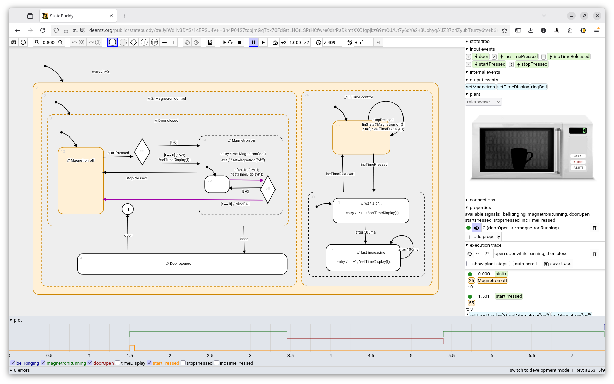

Statechart design, simulation and testing tool, developed with the goal of teaching Statecharts to university students, but probably useful in its own right.

## Features

  - Intuitive editor
      - Low cognitive load: concrete syntax is just a bunch of flat shapes. You manipulate only what you see.
          -  
      - No hidden information: the parser sees exactly what you see, nothing more.
      - Visual feedback from parser during editing.
          - 
  - Simulation
      - step-by-step
      - (scaled) real-time
  - Omniscient debugging (= ability to undo execution steps)
      - logging of microsteps
  - Live modeling (= ability to edit model at runtime -- use at your own risk :)
  - Ability to save / restore execution traces
  - Metric Temporal Logic (MTL) property checking on saved traces
  - No need to install anything, everything runs locally in browser

## Try it now!

Live version available here:
[https://deemz.org/public/statebuddy](https://deemz.org/public/statebuddy)

Or just play with one of the **example models**:

  - [Digital watch](https://deemz.org/public/statebuddy/#eJzNWllvHDcS/iuDeVhIgHbM+9ACC2xixzDWSQzbiwSwlWCsaUmNjLqFnpaPGMlvX7IPHkWyR0n8ED0YHh4fi8WvilXF/ryudnXfdq/6bV+tzz+vu/a+6bfN9b46rM/ffF7f17v1+VogvD5b9+3d8+qqt8M+rs8l3yiEpMKEafOn9Nn60/ocI7nhWgouxmYtfjtbH+pfq2kWVlJshNRCybF/nIU12lCpNJqmcTPrl7qxa2/Nv7+dzZJQlgiCMdcbyUcgqjY8XlEKMXQpIjxo2wWYCqWYiM+QQrANAZgYETx2YlQCpQmo0ckMKolMQDkd+zjWBUyyJCemeiPMn8SSE020BOh4VDXTpISenrHgZMRmKEZjUh5BEzpzUILO0motk4Pi40ERVdIpyxw+wf6kGIKYgk6YWpXOKZVTUenOSaeHT+h49gzLAiaWqZzSbd0wfOmgsBgPijJaEjnDA8ZmeEVoyldCJpFR0bBERrcczajUoEK+CjqqXZUwGU8xKXLGKlRirIyPupWiKKfKYCpnWJZiAJMyNSqGljBJaqtCOzEZl0vnRcVoCqLos0h6XhKNMhkNQ7TJCeiiUjPeijBnBMz4ZUhYgkYFFA9fpYdvnLhjlBYpo7CcPENZ0AxNzUXiBU1OahZUFgVlGa/CmZeUppiIHGGUSq1V+dNXxmknm2douuzK1M+4AIqEFzShPpkoUd68zJw8pc6vGGkYBMVs3L0uCqpSewp2bzBRun06GVTx6CnOeGohcABrVQGdFBthZVHWBJRhp1JqLH/JrU5Cy6IXSG2AYOdXmFpEn+KYsotJ9UE8GyhhS+AK5R3MhYGsPvZhoDY4MtNm/vvo0ep5fX3TpzoTbmFsTjdeODhDHmE9rg93++2n3AUcwGFDwMDxiQji65uubdrUFzIcAhTl0RmwolTcX4hY0UgqrpVHetf2fXtrZ77oqsOh2q0evW1+Mv+t+oK4WCp3KxI0hHEBhxDx2FXTd59Wj1Y/7UYpS4CcGwWM0XAQSRPMNr7RNItgHcyCdSa4aQOZ2EA6BRMFBCYs0uorM/Uug6H4PF9FUuCHSyF8oGZQYilwvJuXlrfuPFY/7e3v75sMk519UrrAZBnt8XV9W5V542M/ymI2UwRpE8n5tnlTN0MedfJ2HbHz7fr0IuNkvflzGBCGhGJlQtmdFLaQ0Mm6x4hOoUVE+vn+6ip1Vv6OpQI6Kw8Um+iL+8NNhglMOSxm0pfyzhN9B/z6g9o2CduUsCAVHSpmdHEVo+yf+/ba5MP/2W+724z7CwJFTGJaU7zEmD+4BSmQX6isNhz6yXTRjF0GsSMG3gEH5Nte9VW3IgdvkDmecOd2GYM3Zoibt6WX1b7aZqWUATAnUEqWO8MyGKNelcb2YoeIUldURLJ7dOGsKm6XxAb28r5p6uY642TRFGuErj70sWbyD9u6N5O/absCIemwozGJQCLeHKM5rNftk12dxglYYrc7jmNfKJAou6WSYGzCIiTCir1zUddEOJ5yWg4TMBOQs/ww2HHV7Ow+/2Xu959t1etx22S9pyOaTSxie6YQGqPbwSDq5rJwuys5ViA4j+9vnrMsI9q76rpunJy98fDDj4zdan86MrEIeRQ+c0A+TuAaIvLYt1uIHIcxUe5eE4LGICqmcp4nzMcJEjPAX5Hjb+4Q3U4k0RHbFLjs0qhCKC8ABwKYKCbDexMsDns56bv76jTVrCTKISoBFUtyzmshjPJbSw9pMUTJnHggmIaCiTCU/Vj30U6vtvtDdqvUhWQKaShe9q5dcPreTyuCABiOCfnVvm5+yZFBSzH7Q0UwtJP8ZblwdUjuRYLqR0FisRg1UB/8KQZiYaaifT1tBw/9nW1IpfHlXyVAloMimGfNZWe2lLUWwbw0gsXhEcfQkWBkfF4uK3LuSEkKFRMb/vNCPK+lP28FLU/mLM/43VfmrC77uk3hzMYcvZVGUM08a8kWrKzsmUi2LGxvIDK9dUSbpRngKYVJDUZ7p6sxhTKGF06WSdLzUduocHhy0UwRRkh0X+d2+66q7nKHMMJRFO2Kpd5gDgOzuxpBGItA9AMNhCETb0wIMCbFsYF81/ZF2xdczkemObAzndzAPM9sFLyxIARsXsX5czYm9oUeYwgw8wVllkJKh4OKHAGWoTXcCEt3IaUKEIBKdRoyZVWhvXM3fIC+FD+8GMDwfLwYwSCBYhmSZAqAMjrxzsLwyuonEoZGwixeg8xcVBMQHmw8oiyJzud5KfPRQVXNJIUxiowPeckZ06D4akLm2BvjAOcB97tNSGcolqg5vKwW4mHpzxwLCdUsoUDLx46cPBIYgkxYjOfIOm8TLHj1JXgI8i7O1tuuaz+EFVFLykO/7QJbcvFpnEUIW86ubHl1utFcIqAZHBgSBCxAsCtvkEzR2C9AfKZBsSgnNHAH1Jc2iYaFgHABFtSy+MICFO5ABI806VtlsAPu019UrgoNTIsWIH4HCAoWq8idMVkqJ2iwAPMPl4zCvDxcgHrHygl85gsSeAkWUNMbMME0wptTeMLCbI9ABSg9JoUUsXi6ZlNVAofT4fYk9yUbnj4deLxgICULBVICFtDToxknQD7KpvbQBHhiYwGDJBof+gPDosjRxmZ4UdQKJcFU+aSU0wTK1+IF5TEUpDUWfjBnHEIJv5AAOSNnCVRgWholUJ62TACpOIQKD1MyCBWe4PDJRAAlEl3511U6va1HavdmLeIqKIf8xgwHgzWEYr4yRDWAglzHPKh042SDXPtnAQ7IAHmPmVLeHyQbDArL5naL61UJGaS/B5RxjmW1KwWgUjJgxyspcUIGrysTlcdQKRmIH0wTtkvizUrG6Z5IyUBRPDgmAw0WEjFUSgafoyianCCTwUIxRUVKBuLOSKiEV9zXIxgCVcLUM/AgGuWJWFQGYbeMz1AmcjEWhDkqdVk+uzXdMZiGEYDwu1BMj8/nHkv4506lQJyooSe1aavTPIZQ2pfKFKxUaagv6QdrwiCU8hUzTUAMrBPjQT6l0TLBijMmWJvU0H40Cz5hkDLZpA93tIT6Si5WH1MZKRIsSYKcARbHMUrM0TsUKQkEs4+/s/aTtA5BeyRBbUNQiMUDbySSFAQaJOfKH1YqV1BRSKtmkKz2Yzen/IRhRBKfqMFyHoYUU/YKnowEJ3u0GnC9SfIIWTF8ITON5hm5qM9sErmg7gcPNxtvQlerr7g3zJISTtiQ2LmCwfMDf++P0nSDvJQmsmFbo3DjB67DW00F/SLG4zpx1jJID2weGj76MnCfeB1HT05cJzcvotMXhJwCW6dounHjelPiM7BxdsGz9PyRIwev0hE4sXtJ5yQv2Sbx29Xb27bZ2dTP/LqpD33bfRp/NCarfPbYeF4kjUyuXGj6zGq37a7af7c1Gea5wbiu++1+9WHbX96sDu3+fqorHm7aD/+tPhnwoe59tv61bW/X52ijztZ1c6i6/lsDY0sNY+XQjv+mbnYvq7v99rJy065M2+sxxzWjurHXN9hpL/at+WUfEsbfj6t399cO4FDvqhfbptr/UO/6G7MlScZhwzvy667ya9nWZ83dff/kfdXYj4Q85rPG5NfNdp/2fH/fZ2e82G+bSKyv26YZ9XiIVnzRtXdGHXUVTX/ysbocdPm6G9The15v3+29zHd2mdxhrKc+u+zBsmP4tbmvN1NV4Nv2/lA9bj/YYx07fcXA912cRROH4klpJugMpwall+zsbH8KUJQ71w1Ed53/uyvt2PQU95vMirqW9hrPzPQu7DM3F4h7uNyEH18Fw8PmcWD8WVUwNO4YB8/fEAXD5qYIbSg2pVhDc4h0dZVCmbZxyPTUHI6Ym8YB/r04GOIbx0HurTbSmmscB80vcuEY1+YWexV4vXA93z6jufePCM+1OkSop7nJHT+supqxh8uAbHN7OCEsHgbjw+YE373VwQVch5uynRU1jNvOKho7M/XUeWSmC0zLCZ725NZKxM/1ZVYrzIu6ZhpVsd3Z3xHnEwJF7faW3N737eTyZ+99F3j6N+unqxP44d4//72aLOzUQJoByYh/rE5+XP0OWk9P7cyTp2/QGUEIXaxOZpTTGWcSzz6MGsoZmN9jkpiWH1dx0wj648pPHU0tgzl2/ElUK5DBtJVoY1fvq+k+tMGY0fj2fbUbrkCrszej11i1zaq9ulqtz958nj/vrZvhxeNQ3/aDmSEbWU19tqULO00ms9hPjvTTuL+2MUPUz7EJ8SobE0xX88IdurQQOyIIPyKI6acPEcTcJH9gmaRfHOmXx/vpUr+y8y8uzsD5n5DTvy8FEJd/hgIJEEP4SxwhOyIvU4J9EcoepaTiX2I/f5lyij+QcuOj+8o2rx6tLqdv1v4etPvyDkPSBdrG8fUyjn2vOYrzZQ85kUJKskDqh+9GSrXA2YfuRh3ZjT7Sb7kzc7Krr6+rbjV94fJlyJhsGxNVUl8u31qEEqzEhzSp+RsZSKYfL/fzv3ZVHu9fXl8cWf8BV/GR/uX15ZH1jxnB8f7l9dWR9Y8Z2cOMcGnAMRePj1EYH+MwPkZifIzF+BjNsBx9zcWYyLy67Nr9PipbfVubtld9dQeqWdaso5rV+/pQv9tXtko31KFg0mpH2Rpm17Xd4cnHu22zs80B5ldftR+jhqddHY/4utrvZzl++z9irUFN)
      - Note: this is the solution to the [Modeling of Software-Intensive Systems 2025-2026 statecharts assignment](http://msdl.uantwerpen.be/people/hv/teaching/MoSIS/assignments/Statecharts).
  - [Microwave oven](https://deemz.org/public/statebuddy/#eJylWd1v3DYS/1cWekpwrsJvig7Sh9S5orimNRIXfYhdQNmlE+HW0kLSxnaD3N9+w5VW4pDUxkD9EMQjzvxmhvNJf83spuqb9n1f9jY7/5q1zb7uy/rT1nbZ+Yev2b7aZOcZyc6yvtn9am97d+ghOy9EbriWZ9ljdk6ZybkW5vij9bezrKv+tuNZKoTJC8qmE8WBTUudE+VRgeu/Ve3wSvj329kRnUXolIq8OKIrchLdUApn5+8DuDI69zTywZvWw+YxNte58AC1PghkguWePKOwFoWiiGvQghvwnK+GWFCDiVgPIhRCHN0BXkVUiRURSubG+zm6o0BUvaSHSeihSUIPyTBVBGpQrIYZ/EEYpi6oQWN3KF24iAwdTM2pW2Hgf+UHx3CVBUPhungrsRZMCBRWY3BoQdE9B87QkqDPY35wrJteyg+aCFItXW4NV8EltjJwAlUchaYRgxc4dqjvBYzPVSJBOU6HwSJSICIPbkMpfPuDIoYH1MU6IRN6yFSSMEgCFJyhJkSkNKEUZ8nylfBEvkaZOeRJUDdCTSAKiP+jDlxF8USfyNgnYa4P0SagQPnUsG4UY6GgAdINiLcPvd8tdDbQ4L+bBhIm6h0c4tGzWY4lCDtCfputMN+RKJjMvUg9FjVtUGD7EimZRb54sboAqav1tunsJhIuFUPCx3qvCmwEkk5j6c3O1gnpiqhceoLGgqGxi5gvXCLhb8tPte3bpl41dcLVJFUVOe7HSvni1ZL429u43kF6oQY2xBIlJ+R7l9n1ZdtftrZL+Z0bkmjcvMAVFslmxJfd7JZEC5lqgkILVCfRlTI2i7Z13z6uXqz+6mw/+efZddbU19nzxB2oBBgv9LKPGPfAHqo+hXV7+xQwPV2IF8HYMu4Fa1Wvr6o7u+Q3yomMy7pgKqymnnQeSX9nt7ZMiqcFT5RIocgJ+Tgb7kvwVrn6WPV5nscAzKhYfxl2A1+8RuJvy65fgRktGFDVn1IAItH3oP3jGu8BeOlQ3va2XUlC7rqEZJ2QrFSxqLpgoWSaliwYbkx8HD/IotKiiJOhf9X/i748xKm75Iuq223Lx2f985cpL5nENRhsi1/zhEkBklg0B1tQJ+DHGcKPf9gRvBZJ/qExSieuXPNFYyRLVqnr+kNVHxYxSG9UdiHRb67rweKn6cR5atZwA5ZPLXylOAp0mq8cyGrdgEeabcJqYVLbB1Rn1CuRo6NQp93g6x/oy+v6KYYVgOrd47G8CRHOLjOq8rz9of+R3CSEioRQyfAugmQKX+bq1asVuXE1uoWa8NpuY3cVRCd6gFR6GaL4ntqySM1xXOAGgPqKJkm9+1f8if6X0JMTmIYt+1/jwGK5N1IsRZdUPAFDi+DyIbhg/Czbtrn350/Xzw6TxRSrBQrKsXQWwRoPg611c+3AYyh6nDDjSwcP1js/vEPYoC6MuyA1WJvDoD0DM1iM/SFkel4gy7OJCpALjiNjHLChCyFghFvAV980OTYBiadcD7UIUAUTiXlNw37j+1kgVAEOjTdfRfD1+12N6gCW8+RLgsGKK4VxwUP+bntkguv1F2U0t4b2KmjI8auWkCx+f5mB3ejt3+ORiYRM3jAYxTOMjnJa7oP9ocDRBHB0egbAZc6v/iwMIUpVcnGm8pR1lAXz4bHvRD7xBiASQnPC44bKCxav7B4yJ4nxSFKxuFNyFplsUsqHD1mBxa5QxExud1keWcNIgtkuMZYqLoLZDrs6OQ8GgxWaByNHC0JSg1/wThE6OpiWRyYSPmN4wGHKUkqST4aanTKYJicOqUImryInOoFIxifBQ2NocWo+5lQFTB5wmE462f8FJ/GbywyseXJLlcVys5VhaOlCpwYmrU4Bm6D+Hpn0iSkrdHVhUpOaJNGkhiwOxosjkzwBzANgE5weZYjAa1FV9r8qNTLJ5fksDGphUrfFJQnHMR9Y6eTbgOTLM5wyETBNhQk1pzydBhY0ji2YsDZVedfUG3/GUok/CZlkjH/nXVGOj7x++qj4QVmIQPiYhKyI3etLHy7SDHZ8rmDdah/9p0oXtuNzZve53G6b+xg6yIYRWioSBgdA1DDo/nLhxh7Qw27tuq+aGgBvQK+7ZmO3v5V3oFx2V61hai2/WHeZn5v7/9hHcO9tue3sWfZ309xB3TnLqrqzbf8W+Mbn1uHwv0HhdxaG9LWdeG6BdjVM2XCqHb7OBMd2uW366bwjXNiP+08zpdrYy7K22z+rTf/Z2U2GY4ed9Kq1FjH/Uu/2/ZsvsDGD4n27n8iw2NXlNv7y+75Pclxuy7r3CT81dT04rkOIl22zA3dUFrG/ebDrvTt81R78MX+5Kj9uZ513Dibh/QPdQXbuvg+/5fsqd+/Mb5t9Zy+ae3eBwxc4jz/cnCVY/tglGYDsHz/kcBIi+JJmwiCIjhma3QKI/yHJEkLMZP/4+KqXBIm+LTFiqOALMHXrHK+nSDP8ZTo+LZrB4Zk+HJ3Wdu/YRJs0PvzlAU506/FS50/Bs+nxUECejqNn7+NhRPSOzq/Y88mZFqowva0GOkx0V4jKfd+MSXbMl52XWx+yn1fPnIG/72y9+uHH1f/ujg57t69rcMxzh1tCin6xY1I+HupVBym1OeShE3MzIL2HXHO+9TL5rcu/973dBQnuLBnTeCR/qboKstiVLpefrofBut92bx52UA+dnR7/69fNAyL83Fb4xE9wo0fMb/8Hw9gRJQ==)
  - [Traffic light](https://deemz.org/public/statebuddy/#eJyVWdtu3DYQ/ZWtHooEcNbiRaLkoi9J0yBoc0FitCgct1B2aVuoLC0krWMnSL+9pER7ycPZbZqHwKbIOWeunKG/JHpdj13/fqxGnZx8Sfpu245Ve9noITk5+5Js63VykhQsOUrGbvOrvhjtrtvkRJXL0v8nj5K75KTIl1z6q1+PkqH+rN0hlikWbCimUwqOFebU33VrkSvz/9ejBx484lEi4iSRpcVS+csiJFJyGdBXMw8Zrno8ut6nISIaLJVqGQDOPBgPVpFHVoiQ58xDlN/EgzFFEFGh6jMRnoHCCogw8Od0KlMh/X1EyjLmwcExbDZIFrIr8pCHKCkeudobIKFB0piIYpSruQDNgAcHns4e4Bi11zGEQdJSEI7J01A18IssIBScO1Mi0chQzWIiOZx1BgEgMAjLJZXwTJqEzvblK+NpDM94iOTsUIaVIQN/lOAP6TJlqfaiF0R2oBazFBZ6BrCZ2lNjIHfVXiJ5RESI8PBcCCUYQaEPoJrMsYwpU+51RxrXT5WFp7PZGzysZkgkI6t/qYDeXiKMCEvGqfwQGeiMJrHxN989324G4jqDwJhFCobZh3ZgVGQURFSeG0R9Owa3apHMi+Zn3Y793eL4Q/vnuh42TXX3Tq9/ML/91etBj6f1te7Nryt7O+t+8eOCxYnF4QZypUKkuPzVK9zpAQoveq3b/0lCsjBP5wjNIMGUT4EdoPCHbpru08TBrFQfGz2xiHXPAIC7Cx3rtYcrd7jVhVWIpUOcpxB+Lk8F2NSXm32TXGiEZjvlqIYvN0e5PBbLkZhw95bcawdTxv7TARFOIaFau1yFyz2AkQdgXnetjkEEWZqiXsAHUWikLE2vYzsVUGilC1MOVc8XXXybaAVV0ImW+z3LmOeBTdfUK/3SZli/3YyTkQ7Hfs6gVrvSJbF0+YhyL2IsH++C2Q1Rr+yLzylf39eQ36pmqx89YY+JpjHlRBctwFuhLpxHCTcsjhe7MuV+ehJXfSbhRiXHgCxAI7MlVM0BUvrJMHhn/RTH/sMH9Gx5OBCM9cL8c0F9ICmFp81Z3U5j4KMPSa/XH5LH54Fq5kKKEUVB2A9niSDWhRd5Z98dhpwuoBg0o9SUBfbRPqhvw91lRsQD1DV3gx6yoIriwQs9IuaEojq/HBqJkL5Xeo6PF2y5GK/qYdHry7prF5edHhYXdT9QqSuI25jB7FOyAKwMwPhyYfoXA6jbGZWq1Mar5PQrcAb0gWQaAPVEfHEsMm76wbHU1APTX1V9330KGiwba8NY9Q88C2qqg5ws7eSjbec2c+CMGJcUtLq5p1lRAqzgVBMhgMzUXO5wo88uzAUe8loEDsASRi3XjZV4FwX6FlQHp1IcCDxYAbAcLrsidzLgPg9xcSISpJVy39JlgciYqjMygwvEBGIAjWE2n+JgvTB80xSDq6TecnDaRWjMRTdVQ5yGyBkgF4pqlGQav2btgAt4Jrqf+/DBx8fNAVfB49u9jOJAeKmSGrQkDAiBlxlDUxcpBcxzYlrzNBb0iHcgoRhjgJyRGYXlLzS1wicedwYf+XxczGSFrelsamhfwoyS4J48d4fAeEG3gQozyanSrkT8ZLJDNrWdUX2OQro+clSs8a3wfp6FXA6RWUG9LgmoSGWAjPlkGimKflbGr38eMn1IygPNA1eRzpzSOapfoLOiXk6w1wx1xsppRgKq9c4hsjNEltRbHtTswM8iqpsSyq97sM6x5w8jjDokiMbAQyZiu4yFSHGofpmGjwDOU3y483ExmZnMSNz4zc3Dxa7ahWR0LZtGaF1X11279lshcw0R3S6jvIcNKv6lwFgn8x5fLaDpC8euv/PxpDW2ewAbriryFUFmfOnuDDkLak07+PKnyTMGVDd6NZoW18g9NySuu7VuXlfXhkky9tXFRb1aNPXlle17h6vu0y/6zqh8UTWDPko+d921kXOU1O2g+/GVOeue4ubNPxtq7/SmqVb64cyFWTudG1Kzq5+/7hbssbdNNz7stws/6Y/by91KvdZvq1Y3v9fr8crewem8bRpzTs08Exx+2W624/MbMzcY4mO/fVg200NbNfGXN9uRPPG2qdrRX3jWte1svCFAfNt3G2OOWgfHn9/q1dZuPu0ne+y+nNpx80HCxsLs8cD0zcIO1rvTb8ttvcTXhZOzZFjZ7bBunD+slrvHT7txEpLYeH5YDba5x6l4p/swbw5mc39z+CHcPI+exOb5Q0Aj2hush3JBM385kDk9iMUip2WbC9V27JyP79218Vx7lrxY/PPIjFRv2sX3i0tL5E372EJUJihutAsDk3k2PqsbvZ48b0+ez8Lfr/quaYLYeVWbtfej3kBIWYoucNzyTT3UJm5ssthosIXMzGb98Px2YzLQmsA7//RpdxssvOjrcMcz4857zK//AhW3X4s=)

## Building

1. install [bun](https://bun.com)
2. run `bun build`
3. build artifacts can be found in `dist/` (`index.html` and a bunch of supporting files). Any static file server can host these files.

## Documentation

See the [cheat sheet](./docs/cheat_sheet.md).

## Technical

StateBuddy was written in TypeScript, using React as the frontend framework.

The [language](./src/statecharts/), which could be used independently from the frontend, consists of:
  - type definitions for
      - [concrete syntax](./src/statecharts/concrete_syntax.ts)
      - [abstract syntax](./src/statecharts/abstract_syntax.ts)
      - [runtime configurations](./src/statecharts/runtime_types.ts)
  - and the following transformations, implemented as [pure functions](https://en.wikipedia.org/wiki/Pure_function):
      - [parser](./src/statecharts/parser.ts) (concrete -> abstract syntax)
      - [interpreter](./src/statecharts/interpreter.ts)
          - initialization (abstract syntax -> runtime configuration)
          - step function ((runtime configuration × event) -> runtime configuration)
