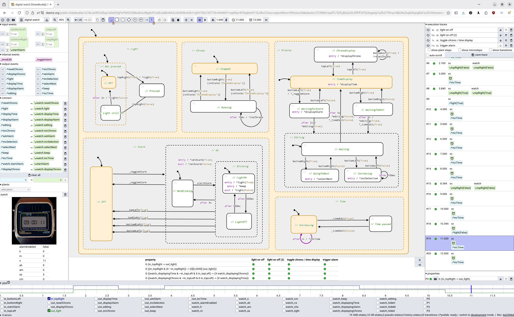
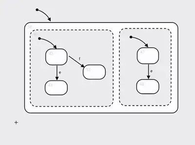
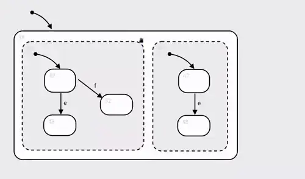
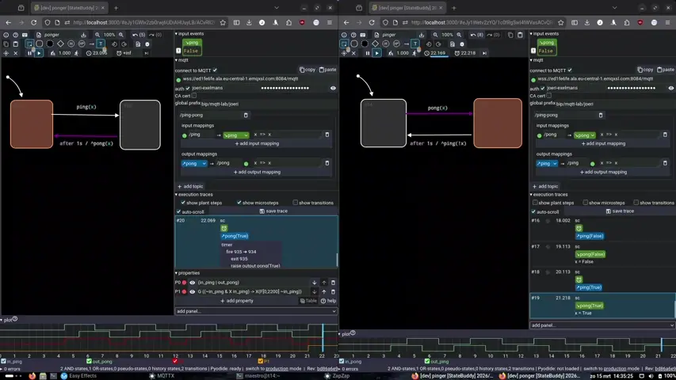

Statechart design, simulation and testing tool, developed with the goal of teaching Statecharts to university students, but probably useful in its own right.




## Features

  - Intuitive editor (inspired by [CouchEdit](https://dl.acm.org/doi/10.1145/3417990.3421401), which was in turn inspired by [StateMate](https://ieeexplore.ieee.org/document/54292))
      - Low cognitive load: concrete syntax is just a bunch of flat shapes, that you can *freely* manipulate.
          -  
      - No hidden information: the parser sees exactly what you see, nothing more, nothing less.
      - Visual feedback from parser during editing.
          - 
          - Syntax highlighting
  - Builtin action language
      - Variables, simple arithmetic, arrays and dictionaries
      - Pattern matching on event parameters
  - Simulation
      - Time simulation
          - step-by-step
          - (scaled) real-time
      - Coupled execution: controller <-> plant(s) (currently 3 hardcoded plant types: digital watch, traffic light, microwave oven)
          - follows Coupled DEVS
  - Omniscient debugging (= ability to undo execution steps)
      - logging of microsteps
  - Live modeling (= ability to edit model at runtime -- use at your own risk :)
  - Ability to save / restore execution traces
  - Metric Temporal Logic (MTL) property checking on saved traces
  - Visual plot of event parameters and plant state over time
  - Real-world side-effects
       - [MQTT](./docs/mqtt/index.md) (over websocket) client
            - ability to map in/out events to MQTT messages
            - ping-pong example (two browser windows talking to each other):
               
  - No need to install anything, everything runs locally in browser

See also the [comparison with Itemis CREATE](./docs/comparison_itemis.md), the tool it meant to replace (for teaching Statecharts).

## Try it now!

<span style="color:red">**Use Firefox or Chrome! For instance, Safari is known not to work 100%. I don't have a Mac so I cannot fix this.**</span>

Live version available here:
[https://deemz.org/public/statebuddy/v2/](https://deemz.org/public/statebuddy/v2)

Or just play with one of the **example models**:

  - [Light Switch](https://deemz.org/public/statebuddy/v2/#eJztfQt8HFXVeO8kfcizII+5kEKkKA+B5rVpU4SmD8AiTfLR8hbsbnaSbLPZTXc3bVMrtE3aphUKbQEL3weUUhAUEat+IiBWKYiKIPJK+UCCSOXDx4fYKh+g/Z9z77kzd3ZnX9nN1t//k185O3fmzDnnnnvuOeeembnZ9fq+AT40anVbvDeS8C8JxxP+hHWxFYuHopGQtcRq7UnAUbBrYSIRbAtFgsFFIWvxrtf3reJDrK/TCoYS0dhcvCcStFrD/pgVnB3p7knEo6rZ3JPAtrzF6Gtv7YnFrEiivSMUh1t729p6Ej0xCy6v5UNlazpj0R6QI9IetuIdwZC/C3jHrYS1JBFv88di0cVxdWMoboWtVhSuLQKXZ8/qBxqr+VB5f3si2n2B1ZYIxkNLQf5QMNgJgsPVfj40eqV/ib+XG+ea1+2CBmfnceOoQH11IBrbBbfiOfNp8znxewtn3wrUTW71w810jRsbuMHF1a1mIFA3xX1xI2eTxcXbzLkBn7i4fED2fEyfEktIhD2SAhxhvhfw1XRNmlR5Qai9IxGvjLa17QJ0SfEZc1vAVxvWrkbsi+w5zsoCvrp4oCeRiEZaYlY8bgVPnhfrsU5xkN7lhi/g83X42xJWrNIXd2jvM3cEfPVLTBiNWG/lpMqrQNGSSxINwHwl4JsMmEtCCTfiuf5wXMMs45w9GaivSrhFSsIy7uUGC9T7vARfLdU1ts8CS4wlWsGuUGGyL2HOjpQUpsFRoK5hFyDKE9dz4zyJFOHG7ICvSl0y/2pukheOM38S8FXbt5QdzdlaeXQUNw4N+DRq6zgbLY9u5+z0QH2Nc2krNw6TR3dytiFQX7t8iznjFnYSyL2OD40b8LRg29qlDZNBS7t1DDna5QdLbZ+r2iukRX+sHzXgsmph0f6qwQqU5MPGueNH4X8fNl61RRyo8/MfovOXvSsOhEEOVsC/FVLNB/QhaUfVgdoGobOLPmxsGRK3SEJXKgZ0ADTYFjmjDlzpkkyq+iyaJXC/mNgHrXF6mbeCtqC4oAXo7wQOvAEw7Al2BI4NBGUIytku4LRV6IUZ/cEwzjYQri0QBTvrsmJos9BFcXml02u8dzSCMSn0xKAePFCA9MmDumW5HAH8B/IeuDJFY8APkUCAjyE4AMGBGup6zgI5oZqAOaAwD1rjhSlG5xBvt+vZqxS3u14MTTWZ3I6Fg8JAzPvkCT5mFzeC0ksCWo2yzNANEu0JQmNvcuPTwgkDVq0iFn1QYv1YYd3PjdMVVp2idcNUifUzhQW+4FSF5VNYEUmLs3EKbS1nzyq0eoW2+tokYkdy42SFNVkJNrdSEjPmyDPmy+aX7E5OUbR6BwlrImE9ZHbZWA2K1oXzSbBTCetp81KFFai25/hAkNBaCO02s91BU/pvXGoS2iJCe0CnZut/w6cI7R5Cu8m0HLRam+m11IPLCO0u83IHTY3Ajk6l258T2nfN8x1fAxZyQF+g2idJzlPd7af2FmIxS6LVS5JTl9Pp82V7ntK4KdEmy9O1Es3cI4mdMoqInyixpkisy6UvM+Oy2SJpmXdJpAYykHeJw8U0egPUvkSg1VTJ08ueIhbTZfvqt6kdlmjV8nSc5sEbsrmog7AMiVUjT69dRqcPku11L1B7jkSrlaev7afTD1H7WrdodUTtO+4erL2fbntEotEIbFpPpwdle+PDdNt4iVZPJhIgtGXUfoDaWyQajcAlQ3T6p7J9fiO110i0KaTdbjr9FdLuvdS+ZbBiowxGh/bZqZEKKYGaBic/SYS6LIiW3WF/b+VZlVVnSkJfkPZkArtD+wK1VRHIlWZFo7HK1nAUsgqJVE/WxC6XWNULACsSrQxY4TBp/mnCWCcxaiAlSczxt0esRCwasTMYRE3QtGZflqi13UDMRpX5G+JdM6DmmMSrWxQEueZEe+LWDJH46FR3zFXz4kGJ7YsCVewDBI9KvFGizf8lob0l0eozEW2cS5OLvS2xJy85Fro1z1HkyZpS6Z5Nz9A9e+U9U7QMEXk1d1tuyeer2f93eUNDp8w1q6squ+JuOzfGCZS6qo4YdGuGrf1rSfvGIfJ6dU9yrygjFRa2g5B9Erkm5hoqB7MxQXMVnQhi1kbdIxWhgVJ+2i/R6mwbikJflQ2dRTZkXCOxfO2A5RjQl8vp8np5uX5xqtY00Rppmhh3DFY8dAbET4jHYyE+ip9a+VMnf3zyp17+TJY/U+RPg/jBMCF/q+m3hn5r6beOfgWtceBl6Xcy/U6h3wb5W1NFv9X0W0O/tfRbR79Er4bo1RC9GqJXI3OtFWJSw+TEs6fB9KPfGvqtpd86+vXRbz39TqbfKfTbIH/riF4d0asjenVEr47o1RG9OknPnITZEB5+WiUvcHwQgoO1TAWahyA41ElLoDUewWFODgKtwxF83Ek4oHUEgiOd5AJaRyE42skkoGUi4FreAM1jEByrZQnQrEAwQc8JoH0cguP1DADalQg+ocd7aJ+AYKIe3aF9IoJP6rEc2p9CcJKM3HB0MoJTEJyKOjt4QNeZNONz5Vw0d3olexJl+aMSZcgj0SMvRS78NY8kT2Lc1CYx3vJI8CTGSpp+bKJHckd5YsxFxJXYSYwoOVejIzWpkxhrZhHG2akJncToVgnYOR7JHEXSqwil0yORIz4q29vgkcRJlJsvJJQfeSRwxChG0iY8kjeJcoUKO7vdiRsOvztx61WJzx1J2e0X9MStMT6OTluk0xZq1+qJW2N8CVE7VLZ7VHuanrk1dsqkzFxPypVZg/mYK3NbeQSxWEjKq6B2zJW5DTxKLD5PQUmF/DWuzK1fDrH5kWyuolyLTXBlbhveodMnURJ1M7U7XJnbpgidfp7aMbdoNAobx7h7sNGg215yZW6bKVNjf5Htr+ym2z7tytxuVgke5Vo3v0LtR/TMrbFLpWS/le2FKkfd6srcVuyh09tJu6dR+zsbRaTLnqItk4mQuTVTirZIzZuedCnaxo2EcXfWFK1/J6HekzlFW1fhzKGsKVpj1F7mZErRGjtuoFEZlUuK1ruZsMtyT9E2f0D3jM8tRWvsIMlx9ZQmRVMGbUz0TtE2kfaNU7KnaI0LLyXklmwpWv+jjrvIkKKtU353WaYUbZFast3qmaJtpBWMcV9OKdqihwj9YYx+VH0xfsPLnsAjrKmMG3BVP8wzzJ2pZY/yfjpnmOaQXu7w11DVme5uMl/T6xz+WtdlPvpy8y29wuGvc183pkPw02sbfp8boXyCQwCDn7/ezX8fxD2nnOGfnCz+f0PUcwoZ/ilJ15kBMc8pYfgbkq6XXwoBz6ldQDRMZvBHCHdO1QJiYRLC6Jtgojr1CoiEySyuhFDnVCogDroRzAjEOadEAUHQu0rB2W0U5ji7XQQ4qv6yaopr5ocQ0ETMU1emUCjjDPo5TcQ5KkAPyejF2YHmYyKwqVLyTPL33PgtBAQRzlRt2qQoxcumQnwSIUzdtVZGJm5sh5gkohZdKf8iRSNefg/EIRGq1KVXKQLx8teQFYYndWmlkqJ8BcQbEZLo0phJFGn46A8wa8MwRJdGb6Powkd/D+KKCD3U3T9QQOHsaAglItoo0adREOHGbggfuEqAtb/9pOKn5tYswURhBiBKeMURul5+N8SI5Aiinj3cAkEhbexQjzFmgaF5Rw2JYf4DgkCmcEFoT0AQ8IwTqie3gt/PFCEIb8w08PXZYwNxfRJcTZagMMY2GWNiSjhQF98CZ+8OBErso8CzZwgBStebYbakc/5K1bPBp3u6fcUrBO7cy+ErKcFX3udy9erGMHjuDE7enLTF9urlL5lnKad+0JotwhuoheHpCM6wHQk0JiGoctw3tARmjeOyoSWWWXWOl4aWWBvWO34ZWmIhOMVxxdASa76pmv+F5pkIPqP5XGieheBszc9CcxqCRt23Qns6ghm6P4X2TASzdB8K7XMQnKv7TWifh+Cz5CzpoctsBOcj+JxcTosaRobHLnJB3SQX0U1y4dwkF8tNcoHcJBfFTXId3CSXvk202m2iBW4TrWmbaBnbRCvXJixtJD3WoSpHM1U5mqnK0UxVjmaqcjRTlaOZqhzNVOVopipHM1U5mqnK0UxVjmaqcjR7VjlaqMrRQlWOFqpytFCVo4WqHC1U5WihKkcLVTlaqMrRQlWOFqpytFCVo4WqHC1U5WihKkcLVTlaEFyAYI7neOmPoeSZOwN1k1GBrmETD97ggorx4HlHUwBdb/baS8V/Q3AhgrlmFVYKgNiUFGIrJTF6PsLLjoecgYhtdpbayA0IzUNwkSeHanvelq3n7BJn4g5WEF/HCCVnEsMWAMhcjOCSvJjKAsilyd0Ya/6jsF4Y22j5Te5HF/MyBJfnRVUMZQMaJM6CvImtwM5AKlTXIIf8r5xRfrYPjiSXGjnGvqphcxmsWIm/VxAzX5XUJVN5D/uAsysks1pHUXHObihUUZ+3qYouVBfQhT7ZBQBXyl5US9mvxKUuHtxn/l1yq3P6cKb5VKFduMomKm3eV2O7n2HSwyfssCTy1Sw5QcTZnkDYOr01HGrtrISQ+5lzIpAenF2ZiFbiGz/KGdzI2SmmTxVTvzD8rszXqIBh5E6HolEaSgACCFodHNVN542a5rY2vOLHG+UEH25HKsTMSSUvlQUpeTXyUJ7rBG6EimIHQeoy2kFtgXYg5qRciftqczEF2ZcG8BJmvVJ823D1lzd35YEv5qy+cP4A2jUqhRmiixKAEIIFaXvb6RhMBM93FKU7nUhFGnWBg6Is2yWoVP48zk5HPiqVfoqzSFEMOyylB7OuK9i99cleAOiSHanLw76MKGQ95mTHhUfp9TD5Bk4xBAQQSceB5nbReEiz6i4OlcJmiaAkDbQbwUIEscwDF016TRGvRXXdrTX/VhT7i0vhim1/aiqldERKv4izA/Te3MHZ74vSnYTdHV/B3enXugNAlux9vnzm1NWcxcwpTj+x7ZpTBUsJYFE6DjSnisZDzoYlxaFS2JxyUQLQi2Cpg5Nm7LqTX+rFi4uRlpyfw+1bOltJ4ScH6UucJfRBe5yzZx2zKMD8v+hQNddy9m6xifLywzn7U/GptnGjovhUL+HGMcWnWs7Zqw7V+2gtnrIMF4tzWW1Ie7EhqZYjlpquE9XJJ5xFkJ4I6967OBNet6Rd5oVFt8715uz/U0rk7B1uzC66NRrruXFy8W18O70QmRyP0xeDnCdk7uoZfVsii3B9GWouzmMhd3lE+8rBXXOAcQW/61TCce2ZuipVFXhM4FMye1XCx3TEM1dRCOiwvdw5RaH0mesyBI6KoHE1gmtstUBDgBUIVjqRqO+fWOfIKZPWtevp9K4SpDSalxQUUibtq3lwPzemp8kghdpX6WOwGsEafQyEztciWJd1TIdHDw5vcOc8WehQzpOGEoANCDZqODIL+TKCa0mDcHhdmq+n8Np6rbPeDi+/zm5yRLypsM66KAG4GcFXHBy9qwBuVL29HjoSkg/6aqviGpHhdSqZjWbaxjLOFnpwS1uhypurNo0u5Ow4jwrKjQg223y9K6R5DKHuT+/mbKJXEfEWN+McH4PY7ouzM8xbc7WnW/WgdBm9zO8R6v4dwX8Mi+rlnL1cdKrGebxsoRfVzNrYj95c8fYcdR3D0xQrUmKpp8fJNnlUqvQ8L5uYZkxuQ3C7PiZ3INiij8mdCLYiuEsf6Te5cXiaEDEMqmLC1XtOuDyoVazC320I7kFwL4L7VPWkPp/68Fc5m202ZKmS59fRrxE9OPyG251noUPuPA0lAA8g+KaHIuyw9dXkT4I19QD4utZVb7eXX1cfdATcXlhXBSWZxG1H8G0E33F31e7l3SmfRePZb3n0VT1S2cyNFUWx4u9qGizYjjV6cPi9wjToogTgIQTfd3CEqfxnkqLUjEn7pTdi3a9RHl5PPXk78zXDd+Y4eH2czUARDlkzXH+x2pM/gIelCJPzcRn/zlmbGP/J9vibU5WCfjB8U3hEo1KYKbgoAXgMwQ8dnOzqSPs9P2I9iuSHOxjpeSt7yLibANmDeHj7A5RDFIQLdttkIU7qeJGM1xl86cMIdqAIysm8xI21RQnAP9KosipednXxqS7lZZ/PpVax/1Ot1frCmRKtJOdfkWXccku09MVzSqKl80B/lNlpupEDGW2a5mr6xeSPETyuj/JOBE/oo/wkgp8geMqZ+8+6vUgWOuRFkijJkPwsgl8ieM7BEVPmpwh+huDnKjo/7SiuGhQHZ36B4BnN/AyLG48p8xs38M9sfVlsL7Pl5Wx3XlYHysvD5vKyOOf11tEnaM/kk9zLrxA8rxvMCwhe1A3vJQQvIxjUXeGd3Pio6FTL7+FlV/3LaeXotKr3q9PaheAVfZT/C8Gr+ii/huDXCF53nNZut9PKQoecVhIl6bR2I/gdgrc1HBnphxC8geA3ym29qW+FhCd+i+At3Wvdzo10cyW//v63Q9XcbJ7j2PRgxdf/qZ/q6IsePQEuUBVywN5RVMic5duQrsksNPay+WzKNEaa7mncae6WdBJ4MNaZSp+S16OcfVLfDOpXZlhekJtBaY7/GPOPGfbh+pn5dvp9uH5vvpB1G64/c3am9zZc73N2UI77cAHqaVlnrPLOQW68lzb6ot7TulHUfU5OtEDtuwLv/yf6t4PuKG4cl8aN/B7BH/S580cEf9Lt/H8QvIvgz5obuYwbz3sQzX8qLf/XNMptGrEXuXH3v1ReUpVP48avvaZOga7L/q5B3Z3jEAxW6IOgbrZdmJ4Eeg2FnuN5DIZ+e+bhUJyTB0RnkHVIkpBzH5R2bvR7peXgod5D8Bfdn+1BsFf3Z39F8DcEH2VNK4dHbwJnZe60MgsdSiuTKIksheH+f6wcwWgNR6aV4pOOfyDYR2klGwVd8dzzEi8yBIaeYka4cWoxdMnGFFeXNj04HFuQLiUlqcuxCMYh+FgmXdqVf6FNPUn30OAObmxJE13z6/EBDlWI2LcUmyasGnnZKcWmar7CjSeLYkBIVOxxOT6PjUtT9oBM3uOyL408cNKn3Dh7mxtXkKveaW7MWWCw9NRH6uaZTt57DTdmaArPLAtQxI2f2MG5K8xhVT5ObAXiLOu2ZV7WuZZe3kuskZBWzsJD+pIKKZu5sTQljg6Hj5rJWmlhN36z7VFY34dUD9Qwy4/gxmO5BixE/nXmgOUMjnEqN+7RB4cMJ82noZri2aEIxhek+MMcxR+ZmbR6kct8LP/JcJje3+2cvedt994dwg3J2NHDYrXN9U3CYMVWjxqEz8umiyaJVK1ZJNLy84z3nUSPG4yXXSGG4wNedjkmgYDwgRa02OFa0JKTaBkv606OXB9HcISuu3e4UTliPqMw/TKO4FiUdvxAkrswzudGWXp3kQeLVHeB+0RMTOsuKnTMJ7lxXs75LSC3Z3vOySboseM6znZqcVXXLO63x44vSLOVyEq8HGN/nV0kDvL1xvcR9xiyVPlBslxsGq9x1qQGchdn/yul+YxyjPVVnsZUWJdPHKxYY8+WT2jDCQC3JMSd+g7tA975fDX0Dme34FYdMkc9qZjSAjhZIy1qXQUR13JiD/ITcMNnAJ92cHJTV9p1xilIXjrGoiom2zDSI/20u/6PFrtmsRtRPDXRnuDs8RGZaELRp0lN3JkSloo73ZxHQy9w4xgK37/gBrfjBRD7pC2QWhFA8n7HiPT9DJuVcDJiUsu+F4eH02s1HWdBro13TvLusSPGCPg6EazxjioVlj7B2YXegiR9UFg8lVd7zA73JwBPJ6cENGkm4GfTmlX8nf4ahUf6VqiIAOo0VuWnczZzRAzQYSUUXl8ihcORz4n6b0IWlO1tt1T9l23i7OKRU0q9PR2miFkpEr3MPFIWBn/KZWGgsct3DPAjKDalKGPwPmdjhzEGuzlbkc8cyENiAA06q3+I3VBzH+5hsMLhrq9OqVX0C6r11WqAzzWvUw7M4sbnaEviYspydvKeQLYIcHkqgjOLxlW+NC/L7HDif2UfG80/4N01btdsSyYnBa6A8pfMniZv2tOkKwfVfMYtgDNNhqWbsxFMy4Wt58TRFy3Pmg/kOnPOpjk+uVTCp5n3CBr1PvzCfDLrukuIr2bjaM6YM/EzV2pGuo8ApuuyrTN/mVTryLheb3CyrlJJKpcUM4c9d3o5Ozj3ySPyL3aWNp/da01YXy7Bi5+y5cMR1ZaYw1LLLATn5KCWczMaKYAZuaxXhjj7oW4EJ3LjUt1AM+0yN9L9A/BZTTZjPS/jWigrFXsRUoTjFmrIyNZ+d03VkMyPUkpIwxBh/EC2zuKWh+xzBduS49puNTekrVTpNgZgtuuddX3ELjRn6i7lrlyqfCPdUwAXyMmKh3NKpFg9avzK9PywKSVElo01d+b8kuNo89WsoWi2PtNHmfPymExF0HqT7SJrcs3PCuAqPiZzeW84Oo9ceH2NHImw+Wt5sIqehDeZ05zl45c4W6Rl6SOroguT2Zd9wI14yUbIYZ9cUinBGGmPI5ZyQ5hqrV7fwI152VxbwqQix8gqZp4eZpsHkwsf2zn7SXLhA7ekZf8mJ5wznuwR8IclG0/c44NdbGtLW4znw9eDRfqU6jaZUnnJoGbUFM4eGOaMyiAKIF2K4LIs7Mt89GdmtHiUa4ornZZWYS2V7DLnvby4o4Z/v9dz1DSvedGgK+dVt77HGX5/BVmv25Wucv7gpPhbsloHck6f5N0bxJ8IAdF+594kIJ3+cF9a9nm3/q5MZZ+mOOGlzwpHENLSVnNJcUTJx7PiZ4GsdTh8db+q9WZyimfFbX/YfLeEOVdPhi+fbmfBJDuDU1+QEv+Fs/fd8uW5wCpAwAnis9gUzw9Hl2guPocF1rucPaf7oPe0fd5yiAKFdgFAhz0NGvJzYYWNb4XrLeAFdpwQfx3j49rIw1G7PcwddsiqK9EwL3APsxbbf2nuSb9vjssOAIT0UP89c0XJxhj32mVdbv9Sktnb6TyZor+GPRMCl+5dnGHtGkbeVphaosmzl7neQP4+Z0+kz9tcg7nd9SLLCI9mFMFCNZol83Ve2gIQy8vXlR3O2TP2QJfU2QhzBNA9mFqoKzuas7vUy4AmvRQirDKu56ancDZUsmHusdmLYa4d+Um7OllHE/BPZwtNUCJXq/zzNs4+lEd3cvZ1KWkjSYp/ClvJivip0tLZZHnxtOe7IxlkXpNe5glYfCXB69RjpSdMMbbLpcjTKV+ow+ZSUcz9IgLcj499CcHV8oOJbGwAXJN9fkzADV2nO27j5+b9JTAnhpsGMty7nPUhdxEDRj50KrbpQueL5pYModNLbaW2Lk1x/Rp/aK4WpiKMQpQIcWcvtq4AU1mVqc+lGCzcvI7h5nXsuv2iam/+0FwvVH09AtzOkOF2hmzj8uW5qDlXJTs+IA23ERhY5QPuNb+ZR7lj2OO7CQFux8du0rnfaj7jfi+8vq40MTlZIFnDuHnE7WxTllGkcCG1E+HGj5wjTdYtwkxwn0m2GQFudshulWaSIYoig3xsshQTH3cvZP+RYYHzYZ5eWpnWG+ajpQhuJD+A2/aD2hRb1enfcaNpP/Q6OUqM9CxKYj9+QMwH3IuJbUGAezCxrTnNh8GKAfeMuN3LsPRnY9dz9ptAvc/LJsF/OYtHc4bzlBHvccbFhTZiY3QXgm0I7kZRSrRYI7bZlJrDUu1YSFAR+R5b+pIpLQeT+KpuEl/j7PdpTAKFL1FNUI14VovOQfmcM9x0CtIDx4rLj+eGUQrv4ljufWrsxTYsKzK/1eH14Tk++9LYpQqWowyHrEnPdAItQe8fLiflo5KLVRD1q/ViVVK2d59eS1N2lr16VQyJAXzDw860wP1nbhyXvnr1tWTbMk7ixuPZbatosgP4pu1Xqj1sy34h1H4d9KiRkUA4h2qPh5+p76SeN2JCqBl+pDbDk5YDuHsk2z6i7Mt2cjamoLdxRlJI+TbOt0eanZpVWnj5tnmXx9s40q8/qCO+be7I+Yu83eZg1rdxUqZp+dmcHZ5mmo6Q7r+jJon8k7j4IDzlKa2btXT9z5vP0dFGLKQXQwr64v80zhpz1cFDCL5fNB3IP5Ga+my2yHy1pPkBbcuVv5q4ah71IW62khqONBVxdoPZWzIVPWxzd16tL4GKknawCXN2JF4KS60BeCSdkjIU1YqvnUf1OP1dPUQ/x1lZhsX1gwhw42D2PbcvEJPR8xF88c1Q+4CB/cB+NntkRh0/pucVY2BESmaJO2z2zkuEJZqsP0pWifvdl6s5OwDP+z21BCvEb5VMST92KSltYp/Vp3+rKDIoDUzlxgO5qmAngkJCisM+6Q+ijDTbigFn+h9t/sFrW3/wEQB+mNEDOCuynELx0/aw3VKEYXvSDoY56g03V2ZPFag33XEeYb43XM0pc9tiXpOrtRVBfAA/ta0tx8y5cLYiX/6Zp2K0PHSf+UoeeWiGL8RK1gOX8FkS7glUxHJHT21VUwLLFX3QhH7G3Oa1nHDG52kPsdUSzcBX5HNbIBbHcH+hc//I/Xc9S8vejJnT91/f2UW8bNn+Y28EObvacVn2m8kqdCe9iuz5ushIiikf4D1bJHZeLyHPdVinZFxJryDj+zzimfxiBI87r69Aq1cRv5Me7wrx3Z9PFaYo/LsB7DmPDFH7iGEDN5rVyiXCjdmyzChzx19JoQG8IORL3btDn5Jd3Jiq2wVtoiQ+Idbe1CWTUPbhXaUscr8BvGRrWJZvduXPznk5mduvWgdyVTmAl5NMBFrPS9UdxY1D3QYiWW3lxmF4/kXbewN4Jr2P1nz7vdxgGZ5EqDLORm6cWGj+8QqC/8phDF5F8LodvZNsqaS8CzS7PNimjJyTPr7LDV9yaTwp5A7ZmUKal/GLLLKHh7ieG+KjpkHdNbxmuwbcS569oQcIiE+jSmZTv7HZ57XSLo6WALzpqMS1zl4nd6mV6+wUHbGd5tWFhvCcVfTbFO57zan7kTvj7LMOe1pA5vDddilk+7r55f2nGWOi2eNw/4Z8GpRGMYHMOxRm/EsWTizWvUrKa9Ap35HJ0O3aUTL7Uxn9gXfB4X74ui17iZeN3X9DW/YiN95w2N8/UmP7f2dAjZlmeD9O1TH7kbu50GxwmG/PYksZ/25NYU4kz794MwxzLM4fyfknMdny53jZo/vRBy11b3te6t6f697LvdQz9idFKJsU0PvJ5jf249C/5d7FrdTs/8jZ6v3nLpdz40YP7klv9mgv1aiHFamPKuQ1WQRQJQCQz30Rq0WqVgRyCumWr3Z9Y4oPiZ2nmO7FlqsYoz9zlxfkHzlx/jre0bRJpSwjiC/JFDVchMgj/MxdrE3UJSwtOOUn8LwDmR9rZKwa5/QoOf26N/cyeu5PC5zdZvANxvTvOOZZL3mYs9ukKS1fsev1fav40GF9wc5QJGhZi0Boq9sf83fJ4y4XKYl8OCEv8od7LCvmj7RbC8Id8QtCoAh/eK9E+nhfWzzaE2u1nED4t0MOX14GV1fzoSP6I/7WRGiR1RLDwJzoXdAtD0JWvK077I8k4p1x/yIrOC/mb7Xio5ZLokf2qYv45yFa8HD2LKs1GonEqSNH9QVCwWAExA8merutrjCqs1J2orq9wx8OL/b3hvWzxgop0tH90WhPorsnMScatMJNQKFTts9BPURCEf3SAtEUVwLx1pA9bm5+znmU/1o+ZK4LRCOhQCzaacUuioUj/p5EB5AItfrxj1sEe+JWrKPbH48vjsaCnXHLaqFjQPIHwtbM6YFWfyjgj1vzot2h1rYEwvie+OL41EmTwtFWf7gjGk9Mbaiqqt4zf/4e+B/59vMhvrKjDUZsHiitM2aBClstPJ4/Hy6v5UPHrFmwKBQPBULhUKI3hJlRiz9ihReIhEkcBrvD0YQVtAI97VYCh6QDeIsrQGGADx27Othp9caDyEXDbbNisWgMtIDS79mzd8+ePVKgipXW4lAQOg820xXn7M5V8vyElWLYOqwl3eBvrGBY6LlSmGJ87y64Hg3h9t0Rf1g/2SVHSj9FhiKO29FCrNYENCpglrSuwJPd1hKrtQf1Xil6FEfD7eNDx61oF8oIW9BeyYeOJ9ur7OuId0QXz5gRXSIOzouFgiE8mGmFw3HZszV86BOrFsCoRue2xqLhcBt0EFS4oCsEzbkwseILhFjisBPYRuIhlCC+lxuJvXv3SE4n9IW6lKF1QNfi1hx/d3BpNNpFhhtfHEq0dkjkiX1dOGBzBBrcFe0C+w9bdjsiBtFutsm/sNIeiSY6QpH2BY4MZvD/AQhDbbc=)
  - [Digital watch](https://deemz.org/public/statebuddy/v2/#eJztXFtv3MYV/iuLfShsQK05M+RcVKBALk4QNE7SWEUCOI5B7VISkRW55VKJHcP97Z3LGe6cmeFq14r6lJfAS/KcOZfvXEnl/bJZt2M/vBzrsVmev18O/V031t31ptktz1+9X9616+X5kizPlmO//bq5Gs1Db5fnVXm2fLc8l/TD2XLX/t7AZSJpZW8QopS+9UvbGfpa//fDmefGEm5CWSJeFhG7gsIdUu259UPAjCbMCGHSyVBUmJ0gzEnN2Ay3MlWUcSeBjGSrmNO0KukMs2pOT1LIiBdxN8rQaIgXT3hxb+lCYWalpPcwExmblY5IcR7bjNgbVM3ZTGa4qRLcVmJunBXATc5wUwk3CRIIEXmAMnejJGKGGSlS2UrhJKAROAh3PmDlnKIkDQNCHNSEipxAKDiBFHNhQDLQpZSDfUSEEM4AhrPs0rAiVDrxOI+ULSuwKZtll4YCYRUEFoukY6WEwJpllwYDF06l0kZjyI0DeqpZbplwkIBTymNuzhPVbD4imXigFLBVRo6l1CFYzvs1DYhKOG5SxPmSODSScl66NCJIJQBdJc9LJ2alo5mQqAB1soj8Sgt3juCz7NKYkMJn2SjLkbII0l+eXS4mpEt0ktBYOnmfsrmYoD4J8zhmfQ6cFy8NCq+tLjaRL3wZkrOupWlQEM49P0HilAI1V8zyS8OCqQKyWlxaQbr5DEAzYSEcXMsqNl1xXwKgmTIhQbYikg2uJ/H/+my5buvbvlub5kT/uml3unl5537Uw9D/FnYt1ETObqyHve8dzm3Fbgxf8LtDhKg+BE1KERNL5xhqU/CemkJTYQpkQE4icgaVglq37slLqG6M0ZCcRuQUuo2yqvDp1HmE6XwUkLNYeAWZW9K88ESF5GVEXgL0SlvPA3LlyKsC6V5F5LIo4XSFyCWF0ynSncfkUJl1NcPkHNBIRUguInIBAV+yApH761TxkFzGpisY0NtQ2dOryitfhvQp6CDt6QqFYUehUeNar6AFTYDHKqdnRQVmwCroTYvQe2UMPcLhOd1mYgY8zyAGH+EAE12ZIwYEYMkQgwR+wrdqJXbhdIPpsAgYxAAkFDKPruaREX1KKkMMlTEEdbrzz7HIiBL6PoEYxCCcam6MQuKLO6XIjTEMSQltjUE7Tj/cZxAkQQJEAc2zjICsb0Bl4IhBgsQKVBVlFamgoM6rUIUqQaKAfsA1CqEEBfQdZRiKVYJEVqjpOewFApxJmMeqBIll5duvyAvllMRDIFUJEnWqgpY4wkEFSYqJMB1UKRJLP10yFUOR+s4iTIdVikU/oBIRoxlQqu8gFjEauXcExZ708Sh5WMuqGIsSoBj7UQJADMIC8hiJHB5TBQaiLCq4jnwQ41BBfVcVJlfTeFyGMOQxDJVvmosqyshQY1UVas9jFEpoVpTE5BymViXDMOKZbAgYjiAIE4hQYT3gMQJpCbaP4FPBPC/L0Hg8xl/FwPMqakNKIEfVjCelGNoNbWMR0XN/AxkvKcbFtMNQEQMfFzLMATzBHkQ6ITSWwGOfIgli9OkUAc/xImsCeyNgkORBJqbVSRUXRN99IyeKJBPySnlhVVxPoNnROS1kkeRCAbMaLaJMJAhwQGqIBIcFJIEyFqGAbExRYyGSXKi1cCkv7gv8GMmIdqVurcfm7Rh21sLOQfqi/vezZ4uv2+ubMR09IFWb2TaQokKkn7e77aZ+l1shAUxQLAuBqD+7Gfqun+VRgRq6RIc8eIZHuqqDTBrRyj3tZT+O/a0heXIx3DVPF89+6n4eml0zzrAkAtotnSlCnmrPs+nG4d3i2eLntdNpjlMFbT9BHpbFnhMQONEyWzCIVp2NAgakIMg23/TjYqtV2jXrhIXfvlGULyRm8FLTbDPEEuKMViE2JD1a/krB6ajlkQwx+N7g0jtn8fNm/zMFK0QtK5A2GOcX7W0zDzbfIxPEoYoBEwj1U/eq7ezq/clPS4Tln5ZPX2dWDRCVaN6ROCS+vbpKXQV1UfcdISGfx53RNKci5AsEGimRAN/N4KWEsskQ+KWaD6gTzTOlPe3L4ARVHDpBq/xm7K+vN80nm3q4zayLoFYwGdZVRQ+4NbPUgW0iU6Huivxx2PAjQHRCEA/11dgMC7rbR8IX9WaXkVbPMTDsh7GpyrywM0ymYaWkyG5JOFhnzDEpC1jYsLAbVjwT5TMs/HqlrBAmcMx8f9d1bXedyVJ+8g+TjMJ4/6FuR038RT/MIIiBa0q0olEqx+Wif75u01JK/Ha7lBVK18V8CM9JAzWxRH2i5NgitqIvdmO72Sz6LpP7aWbvQwoaw63a2RAzLxm1duCkv+s6+WbUGcboOuv7Ctq8Ci2H9NQVn0GKWwvqtlvNlEsFq7sKYVF3urno0MJ5cW0gYmnnAhxWVFWJT6iOOiHjJeiFK4754dblueOSSVrwzoMzgcixk/MI8fsQrgpEm0X9vNtEBA0M929TTPmpTKANACE5iOseywo/Zz8xvbdA2CFJwj3cYoAm2AfktNTPCudJ8/Yy5BLAuHnbjkgrCJOMWiARzgIkSc0Hk6rwOxg04hDC83rN5mb4BEAobB7c33+6abtfckBRfl+jEERJANGDhZlJvwHB9BimX/Y2qX5jLqSukX4SxywwVL/qVkNT77Jg9+/gJWqsCC3isNeZ+naXcQXEqURrM0JxE22TcSZilN8koDmRUJqJGJ0cXzabZjW2mXSu9RDACUGCsmzsGTZzFoVXfxzbQx7tVHhPipotQsuMHIe6eQVv8mI+ATbtIJyXQgA0JeqlCM31y5dNs02Phw5KFdgMIo35g52YV0Mx7GAMUD2kzUaZ/95CMeRYlgC0ygLUb+SUQIowjM+ZYQFysEJbbcIoos2NK/69oMIJiiWVv0wlFvCJglIK0Salfkbhwm/BCIpIFiDn8GTKpN8tMSyBQBwO1QwfRbrmIgAyHobRPR2Jn9U0ExQDDIPH5ZaME5R/WU/QRKwi8BnfL7b1XW7iI2L6GIwg/JTJSHbYHNxzwRbFqf5QnmYF8ds61JWUSS0/6Fm/2EOzBClJzi3zba3Ic0n7Wt/V5uOLeQfTorBLuk4Tf/W5iXUdeLsp2Z+/em3ert/0v3236TX1lRHMvG5fN9/VXbP5oV2PN2anr0F31Xbr7xs9Pazsq3jz88KJpM8f3A1/4YOVyLIwz972GgMv6q3590aL+cL+7teNybVWGM3itl2vN014q+vHG+eywUAgvGWNoU/5ve9vl+fF35TT4p/Nu91eC33hi1BouH6rWWy+qW8Nn3V73Y71ZvFbPa5ulo7m8+by7hqe/uCM8Wk9GNnNXTt2XwxNg875qtvejc9/1alfnz9qiPjL2lldvUnvfHs3Zim+29TdGF74rO865y383NBvm2FsG3T1+dtmdWeevRisxvs7L/51cTFJvDWH7KbvOt1Pu8K1eENGMXmlc8byRhrfbVPbeZRZBQzUNJRXWnbHt7fqvggsv1tpTv3eCvoS3o+2XUSRiNV2M8QmdI46cQPL6RPPcmRHn4L3ZieeFRKfeqJvYT7uSEd99JnNNHCeeJwnPPqkcJg/8aw96dGn+cnr9MMmylM0Czvx05XbU5+gX9Czn6zhRHv0edAVn3iSpTrFjh8XbZ4wf1JCG1kyHBuSg62Y2Hr750+N7I/FPyb/YKr/1lWSd8/tx/62HgS15dXyy8WTtnvj29LFX/+x0BK9sSnQtDD6Nrr/l8WTHxf/Da48fWponnz5qjjT3UjxevFkT//Uc7DSvgHpzFhuWse/eD6mtdG/flzsfzqmPy5iQqfZLF93+6M4G5E0X/MxoY6wXxuowLrLKlyJvagvN82+bxhNCd4Ze9Z3Y/9yNfSbDeoZXrT62sux2eKWRZfubtdCwQ+u28IKdd1frn9t1hdwzqtXri4t+m7Rm6b9vRPB1t9de2u6T/tBkW53L+vrb69sz+LKMxR47zJtvG091LeugTAoQRzMh+NHc3DmeG3ag029G1+2tzbAziUtub6IhV48oU/nBLerqYcIToV5pX2y4CEL3eYXDxNCMvMhyYOtp+d8PUIa87mVyWLlgP1sYY5ZrP2LyKwpqV3jzstgJ4mDlqzoQQhgBjlDlkV50Az3ilDaD3NPFSE2oyiZcFbUE8a1nqtql72zZuPmE66ZE/cD4kGpBeEnsZh1P5Fcu9985dxYwMB30rf/Ge0MaEY7yBGXQ/9LM/x72JgGfnf+7NmmX9Wbm343mk+0zHiq09ONrg7tqnYzIRDqYWtww9223u1+64e1+7Vr9GzoL8CzTWdy32efTBdWtXv4st41F/22Xbmfo/knfJ89wmVFpGKF5KK8vLqSrLhSRFWXotSz62Vd2NWBK3L1dmvaRMsIauX+0oc0B5/9WchOLGTmg8OtXQS8X/7a7lptS7MXsEVs0tVPlYFlAOua2oF4GvybYeiH3fO327pbN+t9bVy7EdtN1J9+2r9Fle7LoV2jC581m81uT21WCNMR7djcujiCsdSCZdG4yVpDczrcyngWPOdm8yMedWg74sGVG9bTR0yjZZcY83I3fnZfQOdw4ByY2LPHTNaB5Q0zBX9/tr9qSsB9mxC0TvGrFjm/WYm3J2ePsPnZ7pq7de/j/UHbmIDi49YxYXd24j4mSlQnLGTsO8ZjNzKPuIGxcjx8BXPaQJMeGk00j7GTmT30EZcys2c+0lYmPe8R1zLpYY+5l0lPe+TFTFa9x93M5HR8pNVMetTj7GayVjx2OWOJ///bmeP2yalmsFCOV+j2L+r+bGJP38agvcj7ZaFNzPRkvPrF9EzElFg/38WTlZ6j3Pv0ws6RwWwdU6J5mD1smqW8OLiVOWKgJof3OvcP1PZD4IcO1IRS+Bsra7+7oXMjtdnv6EZ1sWnGRTsuBleS5uxJhDxtTs7ow+iBfdFps7b/VGNSaVpZGZUsMo1S173bu83DhPNTdj85pU7b3uWAwiV94AJQKHXKJi4nhCzNN/4PEUIp/jFCJM4tudo7d7jrINjPFmYnsrAd7SGgKnJwH3gvSok6ZRWXMyVV1XzcBh9QHMZVQeaRmWWSE6Uq7g25+0WpCjGPz6NF4bw4CLB7HcPt/2vhIY6RjDwsI0smHogNUtADWhyZSEnBDuxqD2VSxIU81Byagzoh2GYjnpu/tTeXw9cywYcSH/9WxjG5d3G2dr3M4WXa9Nj+OLhQ76/kmqLppjk3nFPD676TxoxixkjCmcPrm+jC/nesEGIXdNf++XB9MOmMpvvoKlIBjcfTXhpmWP97P2YGV/aT2eTY/ew0rdHNjBMQobODIAitPI2ZkcnMted2Y76ObsWPolMDh2K25kasKXg50fZNRtYYRjmh46Y9uh0f766upjg8y6+Czz5iAXz2By0S97fabqdHh+Ry8IWbUe/zvjNDa/yl2/8AzZjhQA==)
      - Note: this is the solution to the [Modeling of Software-Intensive Systems 2025-2026 statecharts assignment](http://msdl.uantwerpen.be/people/hv/teaching/MoSIS/assignments/Statecharts).
  - [Microwave oven](https://deemz.org/public/statebuddy/v2/#eJztWF1v3DYW/SuCnhysa4siKUouUqBO0qLYdZs2U/TBdgN5xPEI1UhTiRPbCdzfXn5cSSQleZ3FFsUC+2J4KN7D+3HuuZQ+hbwoRdO+E7ng4dmnsG0Otcjr24p34dnlp/BQFuFZGKPwOBTN/l98I9Su+/AsyY7Dh/AMoeTxOOzKjxzWEUVYP2GUySe/lbUCyOXfx+MBLp7AZQBHmAuXMaofJJmF1rQ2GJ6AoTjWRnGceWgx0Q9wli2hkSlalOF550iSgHOLcHQKhxDTVhRFHhwycDjCS3DJBI7FvZEXK44ik4R0EY1N0OI4NcWLUxct7atKFouaTkOlpqqY+CRJDFqMs0W4bCZzLIN8e97FiUlptugdjmZYEoEXlHpwEQVyL7qHpx0h8Qy7KI49PGYOSpfhph3BiCksoR5aakqUIA/s+jgsynzX1IXdunjaHhmh88jU+C+za3k2bQiSGXuMPMpR43FGH5Uz27KTyvJg+ZKqKMHlbptXVXM3BafIJJEijZK3bXPnBKRaqhN5O9ICg4X0hitws8z6IkZ2OIlvDeeh1DWP+/aJmW3OPPM0BQnAyDFP076RqG2eeuaEGaVimjKjOWHmdCoZbZlnnjmOzTaceubgFZa9P5qTyDNnoJOEuOYYZJJgO3aC/NSB83GG3dTFGNo+ts1j3zyGwsl2cysXUwCmDgD2ATCF8Jnrv3wAJIrs9BEy8QCnIMXI8wAe4NQmD5lQD0OoSUw8D2LjQSJ73gKYsI8QBrrKXACCYtA6Jwc+/xACAJp4OUBZAm3hAPgMRBgjSHbkewDDMkpsAJ+DjIKaxG4OWYqBXHYGqM/BFIN54iYggxKSxFYj6nMwg/ClJrn9BwUkme089TmYUdAOPYimHUCx3UDUZyAlPdO92Pt7BrH5R33+yVONkyiaNSdypisNFPxe2BLI9LSQi/J/Xov2ITgNxMvoy4mYYiCRw2JGR+vT0wCdBKtyx4N1I5GaamasAZEQs4NJkYMSnwQX+W3NJUS9CJWgXmsdf8iIJCfG/vwgRFMfrdoDf3FVX5a1vpweXYXjAc1mcxW+uL6qTdzBrx0XKojXZbev8ocj8WKaC4RBkmPiUII5cbxumjZYV03Hixn3YSRQh5KZA2A5WU8QUgayEts9wSyES/FVdD09GYOeO4KcIDtxklZ25qaDNTJcwE5DJXhKJZXNIYwFtDQFhjPbozSyIwlevgyia81N/OVV/ZwiJYPu2n2XREsp3mymV1gCQyFzcmWRjN+XYhLmN3nVPREniWzKJlYLlfVaRfVk7uVAgkmLbO6xZITJN4K3Aep0usQXaDZhU/cykD9sXzOSZMm9hSjlvIvgSuiEGS935gSDAkdJ4jQ3+3fcTrMYZrBTcrct73JZsjy4KcXJyclMekl/BbTTwNJZNv7alvXtOa+m+pTCKKNOgzM0bRFZon+g5+oOEJKmdu2TzK89jaJdN2Pe3yRc1bFKXEjN+mHPF6tL4PUjSZxJTGcQlpqdwWXGvkqwaMLe+QgII3AXdsiVOhXe5J0IJFlbnneyPjN5gOsIkzdty4kZ/fqs4sBIYg5rqeubHgqNzM/cUICXJpaYWV1Lq+9eqwuInPW84mtRykFwdnmtXpW2zd3bqpGmQuZZvToV/G1e8+qXshBbiaUkeiPfj37i0uO1fq1SP1djlY7uVXla83zlVU8+e9T+aVBlvWsOHb/I9+r/Sjp9oX83BVcdrb2TaLuyKCpuP6obsTVFaMvbrWNl3lvDj02zk+kzMf2TP8jryUaxzyx8Y8cA6ztpX32f7xTIrlzLt7r8Aw/N/tf85nALOx9NXs7zVjmtnur5v2o5d874rt4fxJsPsujdkE+9LJlY59X0yQ8HMWvxtsprYS+8aura1M3d10oKtKLkbqxv7vn6oDavWh3uaHDx42o1bN2rU7rhO5v5qe90mnFDRlRT1dMsiYe9u9RzTXuvCCdrIe9dtcFsdKwXVsq7tURpxhRoAtj9IR+XtWfkeFXWy7aqdZ575jBzP/vE0fLZ51la/xlnDVbz5ziG7nl9L86dp91zzhl2Pyp52BuCPbzRn2Q1SyzKXYbfBkfDye970+CLr4I/xuVdn6KfDnUto3gRqm8okswfOPBXalVk+LnKbyo+dp1Q/O3UsflBNO8kokyATWd1yDvB9y7/Je3rroRusdY1Md2ekA4WKzjlUn0h4kpd9KdKef7ud6FFVckl4Ny0zW+8/bmVfoR33dnpadWs82rbdOIsiyI1l6WrW5nLcp0bnQVDqVcygaHcsM+77q5pC/Or41Jw+wXYy2uVh1dfDwvr3Gy+yTu+avbl2vwU6l/wXMAyXVM5VTOCSRHjhKw36TqLM1xkCb1JOc0HGuT7vRJUDQSEGpceVfH1XPgUfii7UrqjxoSqhXp008hr127QdN62Tdu9ud9LKebFWL/CiKjRzPPz5t4px7dtWTgLryS/u9FaTYfhiFLwnRES0B0dRMCNdsqUDYeryqomGfYZ9X3GVpOFZ2xcGzmeblE9o+fTst9WAz1xAu8lPIAeeGIvCPesM0MOYZ6TOLM97Fej5Olp6IxTM2ijE/XNdWm0+iP0+C+Y+/o2BHeYv3Ug2xJjyeO4e3kg24L310zk/0/g/90J7N2n8DiRx/nrTt3nzlp/7v3X5ysse7MjLO5ysd6+3w4byvq9/lD0tuVdx4vJunnB7zVvftIc/yfz5U/tLosJ)
  - [Traffic light](https://deemz.org/public/statebuddy/v2/#eJydWNtu3DYQ/RVVD0UCuLEoXiRt0YcmTYOgdZMm2xaFkxryimsL1YpbiRvbDdxvLy+jFUlpHdsvhkVyzlw4c2a4n2Ne1VJ072Upebz4HHdi18qyvWh4Hy9OP8e7uooXMYqPYim2P/O11Ieu4wXOjuKbeIGS5PYo7ut/OawjRpDZyXKmdv6uWy1fqr+3RwNaOkGjxKKlqY9WFNSCETqCic7BwhMslGQU0KiPRnMCaMkBNDpBAxGUBZaRLDEbLGMHsMjUMpQwI5SyPLAstWjUqJlDYxO0jKQWjARuprSwYAfdzGZMS+21MVQEjhbWtDQ55Gg+RUtt1FJKAtMwXA1Bh5IDTXMthVjTZOIpdrJwFq6YcZXa3M2S0LqigPw4aFwy46u9hizNgkrIGBh3GG5aCVlujWNkUlg2CEV2EG2mFhC114oZDeHsRnEwcmiawFlhfcUYB2igJg9d/XgUV3W5EW3l0cm0zhCBdMaGN9za2F+KRruse0VXNw4Y1fkHOvvLsmnE1QSdIKhWWhiUsuvElWeRrq9elt1oj709puPDNThcqrWmQLdOpLJAOM2tOpKknjQGUKIu0RHPA3E85ECSeeIpiGepp70ItSfAwCnxbS/Q3iqHjJPQcwYkZarN0Z4MfENccRSKQyqoCw2025gg5mlPA/Eisb4TlHviBVAnw9QVx4F4DszDDMGM4jlUKUmZK05CcQzElWNfnEFy+uI0EKfALDjImgxgMcOueJhzqi9BT/EjT6A9sjxxxcOsQ4QO3ZL5oScp1FDuBS/MO4RyG2SMgrtLEThGPf/DzFNcWEAXwQEAbBDmpi6e5B6iQ/KFFkBSp7qCR4BJ9qGhL4eFO6RvlngWhPmHSAZpzoogiNlAUG4QcZiB6hYggykKAMAChtwCwmEOIpIPAIELlAAvoMSwmOTX0iUxbGhVLar/eSu7m+g4Wul5jnfRd9E3M0McBqbwPGIjyvFxhJ5FUpFu1PGLWrTRheB9tK67Xk7QGB4q34PLPLj0WaQag4LkrcUVLZ82AzyMcMS77dyD6ng1HRUSmFYyl2VIMgqedbzncllveDfThFgBde4mCUGj+FY09Yq/1jHtdlsZHX9o/zqr6r48b/g8KCMUMHPXl2JyVwpJAW2b8uYdr77VuKOp6nO8ybkpBLgde/RI0juU/MlnW2U+hCDzQoDnkAbrfi+bHX/yDXo6Mx3hoRW6SU/ICFeutVco6afpCV1bV5Ij62T56Vd1a54uTz7EKh0+xE8/eoa96jhvp0ZRIFpSuOlFWGgUTZLN1KwCwXyderF2kvPuhFAxsSRHsesXTUL16VQ3ggcR9QqDOMl0endE3s0UjZrGLTNR6lYNRfeLR56CTV5zINkduWfu5YEpjmlu1XgthKYHa3NaidAfGXUrkeJ75eLQ2Zg7ulFyh5O/zFFbzoDDc/cC6ZS5J+UFwZmrsQzetdi9AJpN/Oq9hgD/zfQF1etgYMjcgYWyL9LJt1+kwzTJAdoO9K3Ce/2DHfN73vCVVG1GNbWP+hVwKa7eNkKJym7H9aug4m/Lljd/1JW81KSi6nitRv93XJmwMi8G/bm0Nirdnd0YFm6NNQZCn92IXc9Pyq3+v1EmnphvUXH9lDC2KIhNXVUNd7daoTpXe6Hh64tLT8o+oeJ/hdjEi+RZYX34id+oPr0um57bhR9dm2F9oxCaX8qNhpFduV7Xq6jR+LGV+YGf7y7g9K2NxfOy06brXVPzS1VWnp7X7XYnX35Sl9XvY2iW1b23ZTPdebOTsxJvm7KV7sIL0bb2rvxzndjyTtbcW315zVc7fXbZGY/HnZNfl8vhe6t19PtfouynGW9M9nkx0fTQerEaQiVvttMIDolm3NDZprrlSnlg4YVx+sSJf79SSGKMhVoaW7PaqttAYGJc3c7L6mp6iL59l36cShC/t1aPch6u1Rd/sNahXT9SqxV/aIQfqdSTfrCnj0ojV/ihXkIzepyTRvhWM/LW1vfNS/OrsSlTp+JP41fRf0/U2PGmjb6OLnRo3rRPY/2Di6KKTxzYQbF/Yst/qfvEyGlS00OvUcudFO9XnWgaj89OarX2XvKtT6eKVtq+BjJy1k25A+cMy+UnXi1Bz6n+QYkbhlikhX40b/6RplHpFgQS5534m3e/dcqS+KpfHB83YlU2l6KXiyJJdPNUxqrnjKxXpe1dIKi6Qme70Lbs+yvRVfar56qJDQtwlrc6Ei++3y+sSnv4vOz5Umzrlf2U+l+wXMJysS7yHONCdcPVecVTNd6sKaH0nBXpukD7S1WNbqvblgGC3HGX3EOgwjtl1m51EpiW/Dn+VPe1slp3aHNpdXsWjmCDOwrozE0md91N65nztsLmBPwdtw+cXdgt21i8HfkFyRvLmHOi+sE59KpkXlqO7AdZreJ1LqQUm/3UoUIjuv7l9VYNC3uX1bHKNnjbz58/F9deLr/q6spbeKEM7UdpPb/sVdSSb2xvg3Zo7jbitq+rdNsr1+5oLtmfs5PBPY7a3LjHwZUdFaZHNKGYCeqw3XyYHCLghjv0wMAwq2YfHZgcsf5FbtQ9rCbJ7f+PgHSW)


## User documentation

See the [manual](./docs/readme.md).


## Building


1. Get [bun](https://bun.com).
    
    Alternatively, nix users can instead just enter development shell:

    ```
    nix develop
    ```
2. Run:

    ```
    bun build
    ```
3. Build artifacts can be found in `dist/` (`index.html` and a bunch of supporting files). Any static file server can host these files(*). Nothing else is needed.

(*) The only requirement is that the static file server sets the `Content-Type` HTTP header correctly for JS and WASM files. Most servers (e.g., Nginx) do this automatically without any configuration.


## Development

StateBuddy was written in TypeScript, using React as the frontend framework.

Most of the application state sits at the top of the component hierarchy (`AppState`). It is an object that is JSON (de-)serializable and therefore easily persisted in between page reloads. I tried to divide `AppState` into several hierarchical levels of objects such that detecting changes to parts of the `AppState` can be done 
efficiently to decide whether dependant components should re-render or not (memoization). I refuse to use "state management" libraries such as zustand or redux, because they reverse the purely functional paradigm of React by letting components decide which parts of **global state** they access, rather than letting their parents decide which parts they *can* see.

My biggest frustration with React is having to manually specify which values/components to memoize. It feels like something the language itself should be able to figure out. If I were to re-write StateBuddy from scratch, I would probably give [Elm](https://elm-lang.org) a try.

The [statechart language](./src/statecharts/), which could be used independently from the frontend, consists of:
  - type definitions for
      - [concrete syntax](./src/statecharts/concrete_syntax.ts)
      - [abstract syntax](./src/statecharts/abstract_syntax.ts)
      - [runtime configurations](./src/statecharts/runtime_types.ts)
  - and the following transformations, implemented as [pure functions](https://en.wikipedia.org/wiki/Pure_function):
      - [parser](./src/statecharts/parser.ts) (concrete -> abstract syntax)
      - [interpreter](./src/statecharts/interpreter.ts)
          - initialization (abstract syntax -> runtime configuration)
          - step function ((runtime configuration × event) -> runtime configuration)

The action language embedded within the statechart language is parsed by [Peggy](https://peggyjs.org/). Peggy turned out "good enough" for my purposes, although syntax highlighting required more boilerplate than I like. Further, Peggy allows JavaScript code in the grammar file (a feature I have used), which can be considered dirty because now the grammar depends on JavaScript.

For MTL property checking, an existing library was used: [py-metric-temporal-logic](https://github.com/mvcisback/py-metric-temporal-logic). This library and its dependencies are loaded into an instance of Pyodide (CPython compiled to WebAssembly). Compared to the rest of StateBuddy, Pyodide is slow to start (2-3 seconds in my case). Pyodide runs in a pool of web workers, so it doesn't block the main thread (or the DOM). Each worker contains its own instance of Pyodide, so spinning up an extra thread also takes a few seconds (to boot Pyodide).