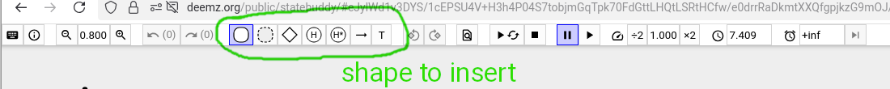

# Cheat Sheet - StateBuddy

## Mouse

 * left mouse button to *select, move, resize*
 * right mouse button to *insert* new states, transitions, etc.
      
 * middle mouse button only to *select*

## Syntax

### States

 * Hierarchical states
    * AND-state: has 0..* children. If active, *all* of the children are active. Basic states are modeled as AND-states without children.
    * OR-state: has 1..* children. If active, *one* of the children is active. An OR-state must have one initial states
 * pseudo-state
 * history-state
    * shallow history
    * deep history

### Text labels

 * comments start with `//`
    * comments are also used to give states a name
 * labels always have the form `trigger [guard] / action0; action1; action2`
    * examples
      * example: `buttonPressed [t == 0] / t=3; ^start`
      * example: `after 2s / ^ringBell`
    * triggers
      * on transitions:
        * `e`, `_e` input / internal event
        * `after 5s`, `after 500ms` timer
      * on states:
        * `entry`, `exit`
 * action language
    * expressions
       * literals
          * `3` numbers
          * `true`, `false` booleans
          * `"hello world"` strings
       * `x` variable references
       * unary operators
          * `!` not (booleans only)
          * `-` negate (numbers only)
       * binary operators
          * `a == b`, `a != b` (not) equals (booleans, numbers, strings)
          * `a > b`, `a < b`, `a <= b`, `a >= b` comparison (numbers only)
          * `+`, `-` sum, difference (numbers only)
    * actions
      * `x = 5` variable assignment
      * `^o`, `^_o` raise output event `o` or internal event `_o`
 * internal event names start with `_` (underscore)
