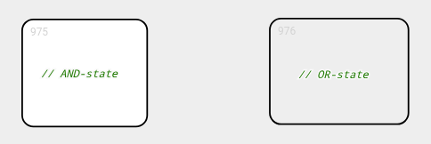
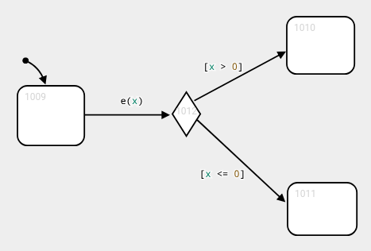
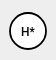

# Cheat Sheet - StateBuddy

## Mouse

Each of three mouse buttons (left, middle, right) can be mapped to any of the available tools, by clicking on the tool button with the desired mouse button (e.g., right-click to map to right mouse button).
The tools are shown in the top panel:

The mouse button mapping is always visible. For instance, in the next screenshot, the 'select / move / resize' tool is mapped to the left mouse button, and the 'draw arrows' tool is mapped to the right mouse button:

## Keyboard shortcuts

 * keyboard shortcuts for toolbar button actions are visible by default, and can be toggled with the `~` (tilde) button.
 * extra shortcuts available in the editor:
    * `Ctrl`+`A` select all shapes
    * `Ctrl`+`C` copy
    * `Ctrl`+`X` cut
    * `Ctrl`+`V` paste
    * `Delete` delete selected shapes

## Syntax

### States

 * Hierarchical states

   

    * AND-state: has 0..* children. If active, *all* of the children are active. Basic states are modeled as AND-states without children.
    * OR-state: has 1..* children. If active, *one* of the children is active. An OR-state must have one initial state.

   More information: see [AND-/OR-states.](./and_or_states.md)

 * pseudo-state: also called *choice-state* in some tools. If a pseudo-state is entered, it **must** be exited within the same run-to-completion step. Pseudo-states are useful when you immediately want to make a follow-up transition depending on some condition:

   

   Note the outgoing transitions of the pseudo-state do not have a trigger (only a guard). This cannot be done with AND-/OR-states which always require a trigger.

 * history-state
    *  shallow history 
    *  deep history

### Text labels

 * comments start with `//`
    * comments are also used to give states a name
 * labels always have the form `trigger [guard] / action0; action1; action2`
    * examples
      * example: `buttonPressed [t == 0] / t=3; ^start`
      * example: `after 2s / ^ringBell`
    * trigger
      * on transitions:
        * `e`, `_e` input / internal event
          * can pattern match on event parameter:
              * `e(x)` if transition fires, the parameter value of `e` is assigned to variable `x`.
              * `e(True)` transition can only fire if parameter of `e` is `True`
                  * same meaning as: `e(x) [x]`
              * `e([x, 2])` transition can only fire if event parameter of `e` is a list with at least two elements, and the 2nd element is equal to `2`. If the transition fires, the 1st element in the list is assigned to `x`.
        * `after 5s`, `after 500ms` timer
      * on states:
        * `entry`, `exit`
    * guard
        = action language expression (see below) that evaluates to a boolean
    * action
         * `x = 5` variable assignment (creates `x` if it doesn't exist yet)
            * `{x: x, y: z} = {x: 1, y: 2}` destructuring assignment
               * will assign `x = 1` and `z = 2`
               * `{x}` is syntactic sugar for `{x: x}` (both in LHS and RHS)
               * destructuring assignment can fail if structures incompatible (runtime error)
            * `True = myBool` assertion that `myBool` must be `True` (runtime error if not)
               * can mix with destructuring assignment: `{x: True} = {x: myBool}` will fail if myBool is `False`.
         * `^o`, `^_o` raise output event `o` or internal event `_o`
 * action language
    * expressions
       * literals
          * `3` numbers
          * `True`, `False` booleans (warning: `true` and `false` with small caps will be seen as variable names!)
          * `"hello world"` strings
       * `x` variable references
       * unary operators
          * `!` not (booleans only)
          * `-` negate (numbers only)
       * binary operators
          * `a == b`, `a != b` (not) equals (booleans, numbers, strings)
          * `a > b`, `a < b`, `a <= b`, `a >= b` comparison (numbers only)
          * `+`, `-` sum, difference (numbers only)
       * structures
          * `{x: 1, y: 2}` dictionaries
          * `["hey", 42, False]` lists

### Naming conventions

 * internal event names **must** start with `_` (underscore)
 * variable names **must** start with a lowercase letter (`[a-z]`)
 * boolean literals start with uppercase letter: `True`, `False`