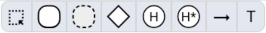
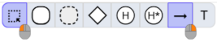

# Cheat Sheet - StateBuddy

## Mouse

Each of three mouse buttons (left, middle, right) can be mapped to any of the available tools, by clicking on the tool button with the desired mouse button (e.g., right-click to map to right mouse button).
The tools are shown in the top panel:

The mouse button mapping is always visible. For instance, in the next screenshot, the 'select / move / resize' tool is mapped to the left mouse button, and the 'draw arrows' tool is mapped to the right mouse button:

## Keyboard shortcuts

 * keyboard shortcuts for toolbar button actions are visible by default, and can be toggled with the `~` (tilde) button.
 * extra shortcuts available in the editor:
    * `Ctrl`+`A` select all shapes
    * `Ctrl`+`C`, `Ctrl`+`X`, `Ctrl`+`V` copy, cut paste

## Syntax

### States

 * Hierarchical states
    * AND-state: has 0..* children. If active, *all* of the children are active. Basic states are modeled as AND-states without children.
    * OR-state: has 1..* children. If active, *one* of the children is active. An OR-state must have one initial states
 * pseudo-state
 * history-state
    * shallow history
    * deep history

### Text labels

 * comments start with `//`
    * comments are also used to give states a name
 * labels always have the form `trigger [guard] / action0; action1; action2`
    * examples
      * example: `buttonPressed [t == 0] / t=3; ^start`
      * example: `after 2s / ^ringBell`
    * triggers
      * on transitions:
        * `e`, `_e` input / internal event
        * `after 5s`, `after 500ms` timer
      * on states:
        * `entry`, `exit`
 * action language
    * expressions
       * literals
          * `3` numbers
          * `True`, `False` booleans (warning: `true` and `false` with small caps will be seen as variable names!)
          * `"hello world"` strings
       * `x` variable references
       * unary operators
          * `!` not (booleans only)
          * `-` negate (numbers only)
       * binary operators
          * `a == b`, `a != b` (not) equals (booleans, numbers, strings)
          * `a > b`, `a < b`, `a <= b`, `a >= b` comparison (numbers only)
          * `+`, `-` sum, difference (numbers only)
    * actions
      * `x = 5` variable assignment
      * `^o`, `^_o` raise output event `o` or internal event `_o`
 * internal event names start with `_` (underscore)
