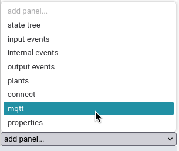
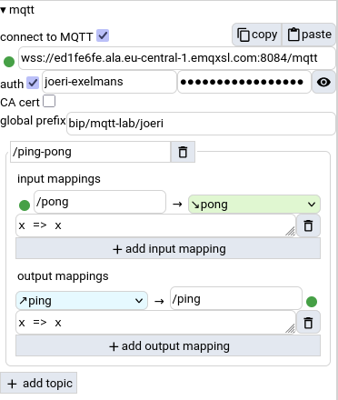

# MQTT client


## MQTT Configuration

To use the builtin MQTT client, add the MQTT panel to your UI if you haven't already done so:



To use MQTT, you *must* configure:
  * a broker URL
  * optionally: user/password authentication, if your broker requires it
     * optionally you can provide a CA cert
  * a global prefix for all topics (can be empty string)

Then, you can start defining mappings: 
  * a Statechart input event is always mapped to an MQTT subscription (incoming messages will raise input events). 
  * a Statechart output event is always mapped to an MQTT publication (a raised output event will cause a message to be published)

For your convenience, mappings are grouped into topic prefixes. The actual set of topics that is used, is obtained by the following simple string concatenation:

```
{global prefix}{topic prefix}{event suffix}
```

**Warning**: Slashes between topic hierarchy levels are not inserted automatically. You must write them yourself. Double slashes are also not removed.

### Example



In the above example, there is one **input mapping**, with a subscription to the topic `bip/mqtt-lab/joeri/ping-pong/pong`.
Note the string `x => x` which is part of the mapping. This is a JavaScript function that maps the payload of received messages into event parameters. In this case, it is the identity function, meaning that whatever is received, becomes the parameter of our input event `pong`.

There is also one **output mapping**, which will publish to the topic `bip/mqtt-lab/joeri/ping-pong/ping` whenever the output event `ping` is raised by the Statechart.

## A word on side effects

MQTT allows your simulation to interact with the **real world**. Output events can cause real side effects (e.g., launching the missiles), so be careful. Likewise, MQTT messages, which are mapped to input events, can be received at uncontrolled times. Unpredictable network delays further add to this uncertainty.

### Careful with time-travel!

When recording an execution trace in StateBuddy, only the sequence of raised input events and their timings is recorded. This is sufficient information to replay a trace entirely, because StateBuddy's semantics are always deterministic. **As long as we are in the simulated world, everything works as expected.**

Received MQTT messages are mapped to input events, so they are recorded just like any other input event. This means that you can still record and replay execution traces, pause, go back in time, ... BUT whatever *real-world thing* you are communicating with over MQTT is obviously NOT going to time-travel with you. Therefore it is best to disable MQTT when replaying traces, or when simulating at scaled real-time. Use your best judgement.
