# StateBuddy Syntax: AND-states and OR-states

StateBuddy has 2 kinds of states: AND-states and OR-states:

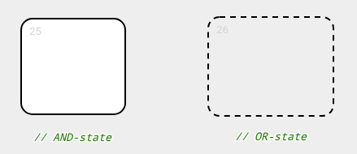

(For Statechart experts, these map precisely onto David Harel's AND-states and OR-states in [On the Formal Semantics of Statecharts](https://www.weizmann.ac.il/math/harel/sites/math.harel/files/users/user56/FormalSemanticsStatecharts.pdf).)

## Flat "state machines"

To model flat states (sometimes called "basic states") in a flat state machine, AND-states are used.

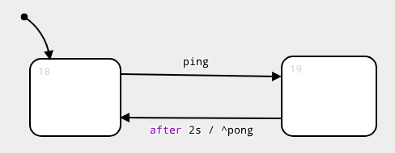

This notation should be familiar.

## Hierarchy

To model "composite states" in a hierarchical state machine, OR-states are used.

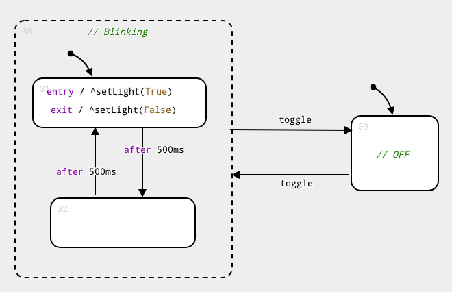

This notation deviates from Statecharts literature, where we usually see something like this:

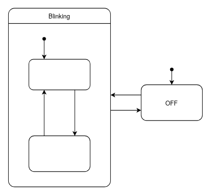

Here the "composite state" has largely the same appearance (solid border, white fill color) as the "basic states". I argue in favor of my own notation because it follows Moody's [Physics of notations](https://ieeexplore.ieee.org/document/5353439), which say (among other things) that:

 - there should be a 1-to-1 mapping between language concepts (= abstract syntax) and their notations (= concrete syntax)
 - different concepts should be clearly visually distinguishable

I argue that the "classic notation" violates both principles. It is insufficiently clear that the OR-state that makes up the "composite state" is something very different from the AND-states that make up the "basic states": the fill-color, the border, and the outer shape are identical.

## Orthogonality

To model "orthogonal regions" in a state machine with orthogonality, we nest OR-states into an AND-state:

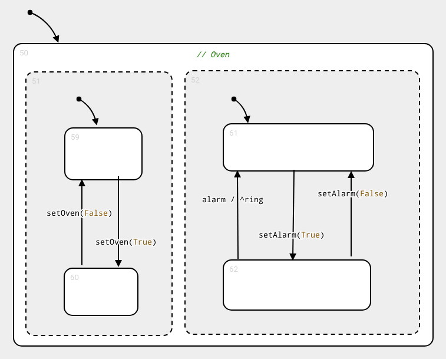

The fact that the regions (= OR-states) have an AND-state parent, is what makes them orthogonal.

In Statecharts literature, we would instead see something like this:

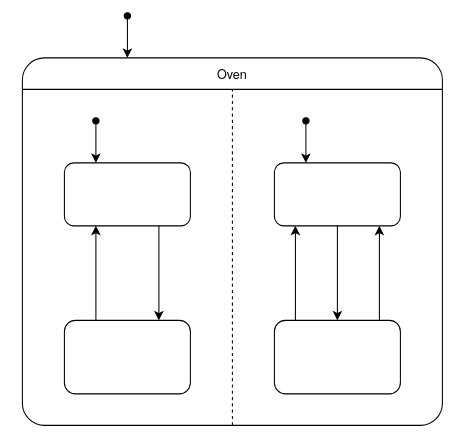

Although stylish, StateBuddy does not use dashed lines because they would be cumbersome to work with, both for the user, and for the parser.

## Implicit root-state

Finally, note that in all examples, the background color of the editor is the same as the fill-color of an OR-state. That's because (semi-)implicitly, the top level of the state hierarchy (= the root), is always an OR-state.

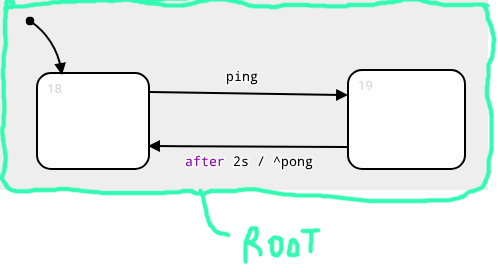

## Technical background

### Algebraic Data Types

A perfect isomorphism exists between the semantics of Statecharts and the semantics of [Algebraic Data Types (ADTs)](https://en.wikipedia.org/wiki/Algebraic_data_type), where the **model** represents a **type**, and a **run-time configuration** represents an **instance** of that type. AND-states map onto product types (e.g., "structs" in C, tuples -- cartesian product). OR-states map onto sum types (e.g., "tagged unions" in C, "enums" in Rust, ... -- set union). In fact, if you ever write a Statechart compiler, that is literally what you do.

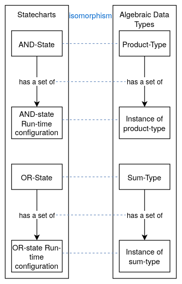

This can be intuitively understood as follows: At run-time, if (and only if) an AND-state is active, then all its children are active. In other words, the run-time state of an AND-state is a tuple containing the run-time states of each of the children. Note that the run-time state of a "basic state", an AND-state without children, is represented by the empty tuple (i.e., a type with one instance).

For OR-states, only one child can be active at a given time. So if an OR-state is active, we must know *which* child is active, and we must know the run-time state of that specific child. Note that in type theory, a sum-type with no elements is an *empty type* (it cannot be instantiated). This corresponds to the fact that an OR-state must have at least one child. In our "hierarchical state machine" example, if turn the OFF-state into an OR-state, StateBuddy complains that the OR-state needs a child:

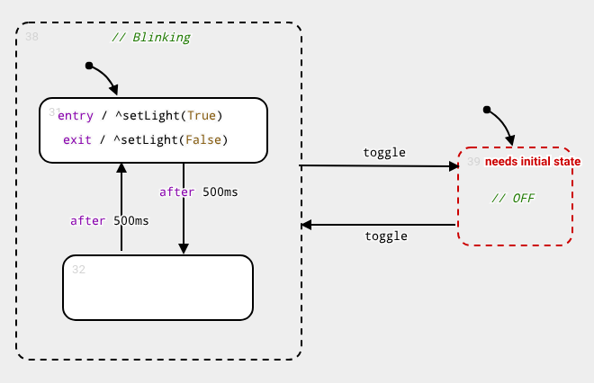

## Arbitrary nesting of AND-states and OR-states

The Statechart tool Itemis CREATE also uses a notation that cleanly distinguishes between AND-states and OR-states, but it enforces a strict alternation of AND-states and OR-states. Therefore, a hierarchical state in Itemis is always an OR-state wrapped in an AND-state:

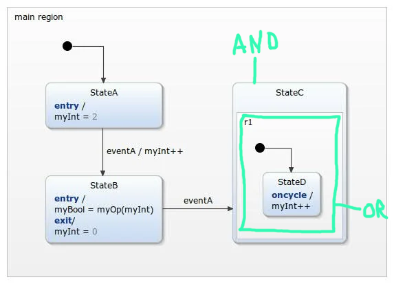

In StateBuddy, you *can* do the same thing... 

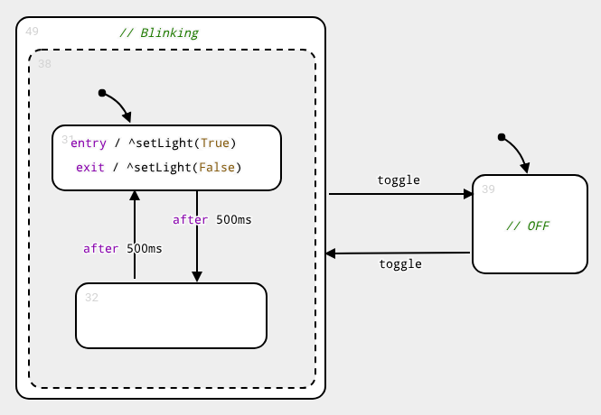

... but:

 - it is not necessary: following link with ADTs (explained above), it is like wrapping a single item (= the OR-state) in a tuple (= the AND-state). Further, product-types and sum-types can be nested arbitrarily, and likewise StateBuddy does not enforce strict alternation of AND-states and OR-states.
 - it is extra work: you have to draw two states
 - it is ugly

## Summary

The most important points are:

 - In StateBuddy, AND-states and OR-states, as [formalized in Harel's paper](https://www.weizmann.ac.il/math/harel/sites/math.harel/files/users/user56/FormalSemanticsStatecharts.pdf),  exist as explicit concepts.
 - You can nest them arbitrarily.